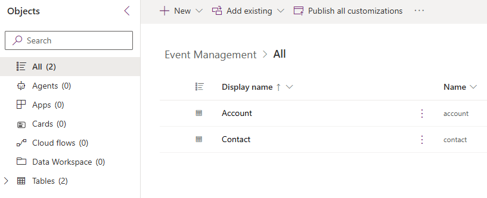

---
lab:
  title: "Laboratorio\_1: Crear una solución"
  learning path: 'Learning Path: Manage the Microsoft Power Platform environment'
  module: 'Module 1: Describe Microsoft Dataverse'
---

## Objetivo de aprendizaje

En este ejercicio, va a crear una solución de Power Platform para almacenar los distintos componentes que compile. En Power Platform, las soluciones se usan para agrupar distintos componentes y proporcionar capacidad de transporte. La solución que cree en este ejercicio se usará durante el resto del curso.

### Escenario

Contoso Consulting es una organización de servicios profesionales especializada en servicios de consultoría de TI e IA. A lo largo del año, ofrecen muchos eventos diferentes a sus clientes. Algunos de estos son eventos tipo ferias comerciales en los que participan muchos socios que proporcionan información sobre nuevos productos, tendencias del mercado y servicios. Otros se producen durante todo el año y son seminarios web rápidos que se usan para proporcionar detalles sobre los productos individuales.

Contoso quiere usar Power Platform para crear una solución de administración de eventos que puedan usar para administrar los diferentes eventos que hospedan a lo largo del año.

En este ejercicio va a crear una solución que se usará para la administración del ciclo de vida de las aplicaciones y para agrupar todas las distintas aplicaciones, sitios y flujos que creamos juntos para que se puedan administrar y transportar fácilmente.

El tiempo estimado para completar este ejercicio es de **15 a 20** minutos.

Tras completar correctamente este ejercicio, hará lo siguiente:

- Creación de una solución de administración de eventos
- Agregue las tablas Cuenta y Contacto existentes a la solución.
- Cree una nueva tabla denominada Eventos desde dentro de la solución.

## Tarea 1: Creación de una solución de administración de eventos

1.  Abra [Power Apps Maker Portal](https://make.powerapps.com).
2.  Vaya a **Soluciones**.
3.  En la barra de comandos, seleccione **Nueva solución.**
4.  En la nueva pantalla de solución, configure lo siguiente:
    - **Nombre para mostrar**: Administración de eventos
    - **Nombre**: Administración de eventos
5.  En **Publicador**, seleccione **+ Nuevo publicador**
6.  Configure el nuevo publicador de la siguiente manera
    - **Nombre para mostrar:** EventMSLEventMSLearnarn
    - **Nombre**: EverntMSLearn
    - **Prefijo:** mslearn
    - **Prefijo de valor de elección:** Deje el valor predeterminado

7.  Seleccione el botón **Guardar** para guardar el publicador.
8.  En el campo **Publicador**, seleccione el publicador **EventMSlearn** que acaba de crear.
9.  Seleccione **Establecer como solución preferida**.

10.  Seleccione **Crear**.

## Tarea 2: Agregue componentes existentes a una solución.

Ahora que hemos creado una solución para almacenar nuestros componentes, vamos a agregarle algunas tablas existentes. Vamos a agregar las tablas Cuenta y Contacto para que se puedan usar fácilmente en nuestras diferentes aplicaciones, flujos y sitios de administración de eventos. En primer lugar, agregaremos la tabla Cuenta a la solución.

1.  Si es necesario, vaya a la solución de **administración de eventos** que creó en la tarea anterior.
2.  En la **Barra de comandos**, seleccione **Agregar existente.**
3.  En el menú que aparece, seleccione **Tabla**.
4.  Seleccione la tabla **Cuenta** y, a continuación, seleccione **Siguiente.**
5.  En la pantalla **Seleccionar tablas**, seleccione **Incluir todos los objetos.**
6.  Seleccione **Agregar**.

Ahora que tenemos la tabla Cuenta, vamos a agregar la tabla de contactos.

7.  En la **barra de comandos**, vuelva a seleccionar el botón **Agregar existente****.**
8.  En el menú que aparece, seleccione **Tabla.**
9.  Seleccione la tabla **Contacto** y, a continuación, seleccione **Siguiente.**
10.  En la pantalla **Seleccionar tablas**, seleccione **Incluir todos los objetos**
11.  Seleccione **Agregar**.

Enhorabuena, ha creado correctamente una nueva solución mediante Microsoft Power Platform. Seguiremos usando la solución para agregarle componentes adicionales.
