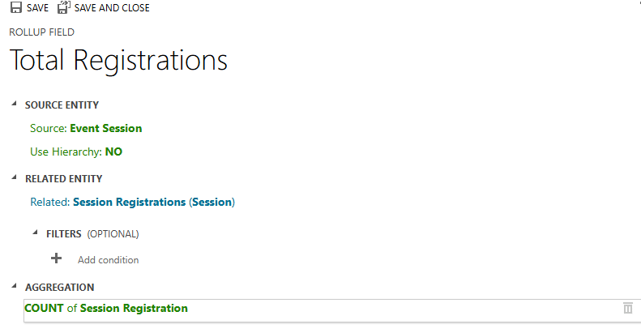

---
lab:
  title: "Laboratorio\_2: Crear un modelo de datos"
  learning path: 'Learning Path: Manage the Microsoft Power Platform environment'
  module: 'Module 1: Describe Microsoft Dataverse'
---

## Objetivo de aprendizaje

En este ejercicio, los alumnos usarán Copilot para crear un modelo de datos. Proporcionará una descripción del tipo de tablas que desea compilar y usará el diseñador para realizar cambios según sea necesario, como agregar columnas adicionales.

Al completar este laboratorio, harás lo siguiente:

- Use Copilot para ayudarle a crear un modelo de datos.
- Agregue y edite columnas a tablas.

### Escenario

Contoso Consulting es una organización de servicios profesionales especializada en servicios de consultoría de TI e IA. A lo largo del año, ofrecen muchos eventos diferentes a sus clientes. Algunos de estos son eventos tipo ferias comerciales en los que participan muchos socios que proporcionan información sobre nuevos productos, tendencias del mercado y servicios. Otros se producen durante todo el año y son seminarios web rápidos que se usan para proporcionar detalles sobre los productos individuales.

Contoso quiere usar Power Platform para crear una solución de administración de eventos que puedan usar para administrar los diferentes eventos que hospedan a lo largo del año. Además, Contoso quiere desarrollar algunas aplicaciones para apoyar su programa de restauración de equipos de empleados. 

En este ejercicio se va a crear un modo de datos que se utilizará para almacenar los diferentes tipos de eventos, inscripciones a eventos y otros datos necesarios para que Contoso gestione eficazmente sus eventos. También va a crear una tabla equipo que se usará en sus otras aplicaciones.  

### Detalles del laboratorio

Antes de comenzar este ejercicio, se recomienda que haya completado:

- **Lab 1: Creación de una solución**

> **Importante:** Este laboratorio usa IA para crear los componentes. Dado que los resultados de la inteligencia artificial pueden variar, es importante tener en cuenta que los resultados pueden ser diferentes (pero similares) a lo que se define en el laboratorio. Los conceptos básicos descritos en el laboratorio serán los mismos independientemente de lo que se haya creado o de lo que se haya llamado. Si las tablas y columnas no coinciden exactamente, es posible que tenga que ajustarse a lo que se creó automáticamente.

### Duración del laboratorio

El tiempo estimado para completar este ejercicio es de **30 a 45** minutos.

> **Nota:** En el laboratorio anterior, creamos una solución de administración de eventos y la establecemos como la solución preferida en este entorno. Por ese motivo, no es necesario ir directamente a la solución para crear nuestro modelo de datos. Los elementos que creamos se agregarán automáticamente a la solución.

## Tarea 1: Crear un modelo de datos

Contoso almacena actualmente la información de contacto de los donantes en su instancia Dataverse. Les gustaría utilizar Dataverse para hacer un seguimiento de las concesiones que solicitan y las donaciones que reciben. Debe crear las tablas necesarias para admitir las necesidades futuras de la aplicación de Contoso.

1.  Si es necesario, abra un explorador web y vaya al portal de [Power Apps](https://make.powerapps.com/) Maker Portal e Inicie sesión con las credenciales de la cuenta Microsoft.
1.  En la pantalla principal de Power Pages, con el panel de navegación de la izquierda, seleccione **Tablas**.
1.  En **Tablas**, seleccione **Introducción a Copilot**.
1.  En la pantalla **Describir las tablas que desea que construya Copilot**, escriba lo siguiente: “*Crear una tabla para administrar eventos. La tabla debe identificar el nombre del evento, los datos del evento, la ubicación, el número máximo de asistentes y los detalles del evento.”*
1.  Junto al botón **Generar**, seleccione **Configuración de tabla** y configúrela como se indica a continuación:
    - **Opciones de tabla:** Una tabla
    - **NO** incluya relaciones.

    

1.  Selecciona el botón **Generar**.

    > **Importante:** Copilot solo debe crear **UNA** tabla llamada **Eventos**. Si se han creado más, deberá **ELIMINAR** estas indicando a Copilot el nombre de la tabla que desea eliminar. **Si no se eliminan las tablas adicionales, el siguiente paso se verá afectado.**

    

**Editar el modelo de datos con Copilot**

Ahora que hemos creado la tabla, vamos a añadirle algunas columnas adicionales. Comenzaremos agregando una columna de tipo de evento. Además, los contactos asistirán a nuestros eventos. Queremos agregar la tabla Contacto existente al modelo de datos y asociarla a registros de eventos más adelante.

7.  En el campo **Qué desea hacer a continuación**, escriba: *`Add a choice column named Event Type to Event table.`*
1.  Agregue otra columna; escriba el texto siguiente: *`Add a choice column named Registration Required to Event table.`*

    

    > **Importante:** La tabla de eventos no tiene que coincidir exactamente con la imagen anterior, pero debe tener al menos las columnas siguientes:
    - Nombre de evento
    - Fecha de evento
    - Núm. máx. de asistentes
    - Location
    - Tipo de evento
    - Registro requerido.

    Si no tiene todas las columnas mencionadas anteriormente, use Copilot para agregarlas al modelo de datos.  

    A continuación, vamos a agregar la tabla **Contacto** al modelo de datos.

1.  En la **Barra de comandos** de la parte superior, seleccione **+ Tabla existente.**
1.  En el campo **Buscar**, escriba **Contacto** y seleccione **Agregar seleccionado**.

    Según el tipo de evento, puede haber una o varias sesiones. Para administrar las distintas sesiones, es necesario definir cuál es la sesión y el evento con el que está asociado. A continuación, usaremos Copilot para crear una tabla de sesiones de eventos.

1.  En el campo **Qué desea hacer a continuación**, escriba: *`Add a new table called Event Session. `*

    Copilot creará probablemente dos tablas, Sesión de evento y Ponente de eventos. Puesto que nuestros contactos serán ponentes, vamos a quitar la tabla Ponente de eventos.

1.  Si es necesario, en el campo **Qué desea hacer a continuación**, escriba: *`Remove the Event Speaker table.`*
1.  En Copilot, escriba el texto siguiente: *`Add a new text column to the Event Session table called Session Description.`*

    

    A continuación, vamos a agregar una última tabla denominada **Registros de sesión**. Esta tabla se usará para administrar las personas que se registran para sesiones específicas.

1.  En Copilot, escriba el texto siguiente: *`Add a new table called Session Registrations.`*

    Es probable que Copilot cree dos tablas, registro de sesión, sesión o participante (o algo más). Puesto que nuestros contactos pueden ser participantes, vamos a quitar la tabla Participante. Si se crearon otras tablas (como Session u otra cosa) que no sean Registro de sesión, quítelas.

1.  Si es necesario, en Copilot, escriba el texto siguiente: *`Remove the Participant table.`*
    
    A veces, se agregará una columna Nombre de participante a la tabla de registro de sesión. Es necesario quitarlo, ya que puede causar problemas más adelante al intentar guardar el modelo de datos. (Vamos a reemplazarlo por una columna de participante diferente más adelante).  

1.  Si es necesario, en Copilot, escriba el texto siguiente: *`Remove the Participant Name column from the Session Registration table.`*

1.  Si ahora tiene un campo Columna principal, escriba el texto siguiente: *`Rename the Primary Column to Registration Name in Session Registration table.`*

1.  En Copilot, escriba el texto siguiente: *`Add a text column to the Session registration table called Special Instructions.`*

    La tabla de registro de sesión completada debe ser similar a la siguiente imagen:

    

    > **Importante** Aunque no es necesario que la suya coincida exactamente, es importante que no tenga una columna llamada Participante y que tenga al menos lo siguiente:
    - Nombre de registro
    - Fecha de sesión
    - Instrucciones especiales

    Ahora vamos a crear relaciones entre nuestras distintas tablas. Puesto que los registros de contacto pueden ser ponentes en sesiones, vamos a crear una relación entre las tablas Contacto y Sesión de eventos.

1.  En la barra Comandos, seleccione **Crear relaciones**.
1.  Configure la relación como sigue:
    - **Tipo de relación:** Uno a varios
    - **Uno:** Contacto
    - **Varios:** Sesión de eventos
    - **Nombre para mostrar**: `Speaker`
1.  Selecciona **Listo.**

    

    Dado que los contactos pueden registrarse para sesiones en sesiones, vamos a crear una relación entre las tablas Contacto y Registro de sesión.

1.  En la barra Comandos, seleccione **Crear relaciones**.
1.  Configure la relación como sigue:
    - **Tipo de relación:** Uno a varios
    - **Uno:** Contacto
    - **Varios:** Registro de sesión
    - **Nombre para mostrar**: `Participant`

    

1.  Selecciona **Listo.**

    Un único evento puede tener varias sesiones asociadas, por lo que vamos a crear una relación entre las tablas Evento y Sesión de eventos.

1.  En la barra Comandos, seleccione **Crear relaciones**.
1.  Configure la relación como sigue:
    - **Tipo de relación:** Uno a varios
    - **Uno:** Evento
    - **Varios:** Sesión de eventos
    - **Nombre para mostrar**: `Event`

    

1. Selecciona **Listo.**

    Por último, los participantes se registran para sesiones de eventos, por lo que tendremos que crear una relación entre las tablas Sesión de eventos y Registros de sesión.

1.  En la barra Comandos, seleccione **Crear relaciones**.
1.  Configure la relación como sigue:
    - **Tipo de relación:** Uno a varios
    - **Uno:** Sesión de eventos
    - **Varios:** Registros de sesión
    - **Nombre para mostrar**: `Event Session`

    

1.  Selecciona **Listo.**

    El modelo de datos recién creado debe ser similar a la imagen:

    

1.  Seleccione **Guardar y salir**.

## Tarea 2: Editar tablas y columnas directamente

Copilot es una manera maravillosa de crear tablas y columnas muy rápidamente. Sin embargo, puede haber ocasiones en las que necesite realizar modificaciones en tablas y columnas directamente. Por ejemplo, en esta tarea vamos a actualizar algunas columnas existentes, así como realizar un seguimiento del número de participantes registrados para una sesión específica.

1.  Si es necesario, abra un explorador web y vaya al portal de [Power Apps](https://make.powerapps.com/) Maker Portal e Inicie sesión con las credenciales de la cuenta Microsoft.
1.  En el panel de navegación de la izquierda, selecciona **Tablas**.
1.  En el campo **Buscar**, escriba **Evento**.
1.  Abra la tabla **Evento**.
1.  Bajo el título **Esquema**, seleccione **Columnas**.
1.  Busque y abra la columna **Tipo de evento**.
1.  Reemplace las etiquetas por lo siguiente:
    - Conferencia
    - Feria comercial
    - Seminario web
    - Almuerzo y aprendizaje
    - Launch
1.  Establezca **Opción predeterminada** en **Ninguna**.

    

1.  Selecciona el botón **Guardar**. (*Si la columna no se guarda la primera vez, inténtelo de nuevo.*)

    A continuación, añadiremos una nueva columna a la tabla **Sesión de eventos** para realizar un seguimiento del número total de inscripciones a la sesión.

1.  Utilizando la navegación de la izquierda, seleccione **Tablas** para salir de la tabla **Evento**.
1.  En el campo **Buscar**, escriba **Evento**.
1.  Abra la tabla **Sesión de eventos**.
1.  Bajo el título **Esquema**, seleccione **Columnas**.
1.  En la barra de comandos, seleccione el botón **Nueva columna**.
1.  Configure la nueva columna de la siguiente manera:
    - **Nombre para mostrar**: `Total Registrations`
    - **Tipo de datos:** Número entero
    - **Comportamiento**: Paquete acumulativo

    

1.  Seleccione **Guardar y editar**.

    > **Importante:** Si tiene activado el bloqueador de elementos emergentes, es posible que deba desactivarlo para que se muestre el campo acumulativo.

1.  Configure la columna de acumulación de la siguiente manera:
    - En **Entidad relacionada**, seleccione **Agregar entidad relacionada**.
    - Seleccione la tabla **Registro de sesión**.
    - Seleccione el botón **Guardar cambios** (*Marca de verificación*)
    - En **Agregación**, seleccione **Agregar agregación**.
    - En **Función agregada**, seleccione **eEcuento**.
    - En el campo **Entidad relacionada agregada**, seleccione **Registro de sesión**.
    - Seleccione el botón **Guardar cambios** *(Marca de verificación)*.

    

1.  Seleccione el botón **Guardar y cerrar**.

    Ahora ha creado correctamente el modelo de datos que se usará para admitir la aplicación de administración de eventos. 

## Tarea 3: Crear una tabla de equipos

Además de administrar eventos, Contoso tiene un programa de restauración de empleados.  A continuación, crearemos la tabla para almacenar el equipo. 
1.  En el panel de navegación de la izquierda, selecciona **Tablas**.
1.  En **Tablas**, seleccione **Introducción a Copilot**.
1.  En la pantalla **Describir las tablas que desea que construya Copilot**, escriba: *`Create a table for checking out equipment. The table should include the Equipment Name, Due Date, and Item number.`*
1.  Junto al botón **Generar**, seleccione **Configuración de tabla** y configúrela como se indica a continuación:
    - **Opciones de tabla:** Una tabla
    - **NO** incluya relaciones.

    

1. Selecciona el botón **Generar**.

    > **Importante:** Copilot solo debe crear una tabla denominada **Equipo de restauración**. Si se crearon más, puede eliminarlos, indicando a Copilot el nombre de la tabla que se va a eliminar.

**Editar el modelo de datos con Copilot**

Ahora que hemos creado la tabla, vamos a añadirle algunas columnas adicionales. Comenzaremos agregando una columna de tipo de evento. Además, los contactos asistirán a nuestros eventos. Queremos agregar la tabla Contacto existente al modelo de datos y asociarla a registros de eventos más adelante.

6.  En el campo **Qué desea hacer a continuación**, escriba: *`Rename the table to Equipment.`*
1.  En el campo **Qué desea hacer a continuación**, escriba: *`Add a choice column named Equipment type.`*
1.  Agregue otra columna; escriba el texto siguiente: *`Add a text column named Category.`*
1.  Agregue otra columna; escriba el texto siguiente: *`Add a text column named Status.`*

    Una vez finalizada la tabla, debería tener un aspecto similar al de la imagen siguiente:

    

1.  Si la tabla incluye columnas adicionales, escriba *`Delete the [column name] column.`* para quitarlas
1.  Una vez que la tabla coincida con la imagen, seleccione **Guardar y salir**.

## Tarea 4: Modificar la tabla Equipo directamente

1.  Si es necesario, abra un explorador web y vaya al portal de Power Apps Maker Portal e Inicie sesión con las credenciales de la cuenta Microsoft.
1.  En el panel de navegación de la izquierda, selecciona **Tablas**.
1.  En el campo **Buscar**, escriba **Equipo**.
1.  Abra la tabla **Equipo**.
1.  Bajo el título **Esquema**, seleccione **Columnas**.
1.  Localice y abra la columna **Tipo de equipo**.
1.  Si es necesario, reemplace las etiquetas por lo siguiente:
    - Electrónica
    - Mobiliario
    - Herramientas
    - Accesorios
1.  Establezca **Opción predeterminada** en **Ninguna**.

    

1.  Selecciona el botón Guardar. (Si la columna no se guarda la primera vez, inténtelo de nuevo.)

Enhorabuena, ha creado correctamente un modelo de datos en Microsoft Dataverse.

