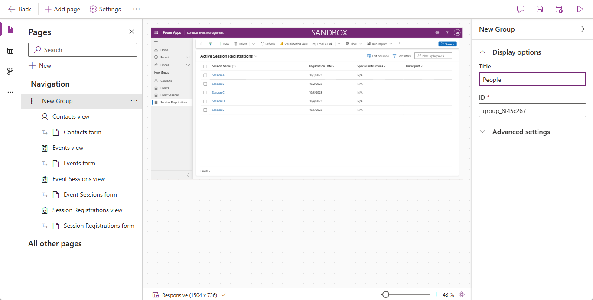
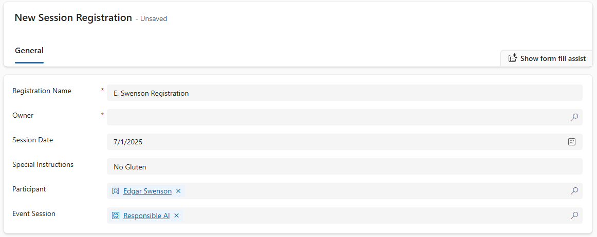

---
lab:
  title: "Laboratorio\_4: Crear una aplicación basada en modelo"
  learning path: 'Learning Path: Demonstrate the capabilities of Microsoft Power Apps'
  module: 'Module 3: Build a model-driven app'
---
## Objetivo de aprendizaje

En este ejercicio, los alumnos crearán una aplicación controlada por modelos en Power Apps mediante Copilot. Definirá el modelo de datos, modificará formularios y vistas y creará la aplicación.

**Al completar este laboratorio, harás lo siguiente:**

-   Cree una aplicación controlada por modelos.
-   Modifique formularios y vistas en la aplicación para adaptarse mejor a sus necesidades.
-   Navegue por una aplicación controlada por modelos.

### Escenario

Contoso Consulting es una organización de servicios profesionales especializada en servicios de consultoría de TI e IA. A lo largo del año, ofrecen muchos eventos diferentes a sus clientes. Algunos de estos son eventos tipo ferias comerciales en los que participan muchos socios que proporcionan información sobre nuevos productos, tendencias del mercado y servicios. Otros se producen durante todo el año y son seminarios web rápidos que se usan para proporcionar detalles sobre los productos individuales.

Contoso quiere usar Power Platform para crear una solución de administración de eventos que puedan usar para administrar los diferentes eventos que hospedan a lo largo del año.

En este ejercicio va a compilar una aplicación controlada por modelos para administrar eventos de Contoso. La aplicación controlada por modelos se basará en un modelo de datos existente e incluirá eventos, sesiones de eventos y registros de sesión.

### Detalles del laboratorio:

Antes de comenzar este ejercicio, se recomienda que se hayan completado:

-   **Lab 1: Creación de una solución**
-   **Laboratorio 2: Creación de un modelo de datos**

El tiempo estimado para completar este ejercicio es de **20 a 30** minutos.

## Tarea 1: Creación de un modelo de datos para admitir la nueva aplicación controlada por modelos

Contoso almacena actualmente la información de contacto en su instancia de Dataverse, por lo que les gustaría usar Dataverse para realizar un seguimiento de los cursos y los registros de cursos. Debe crear las tablas necesarias para admitir la aplicación y crear una aplicación controlada por modelos basada en ese modelo de datos.

1.  Si es necesario, abra un explorador web y vaya al portal de [Power Apps](https://make.powerapps.com/) Maker Portal e Inicie sesión con las credenciales de la cuenta Microsoft.
1.  En el panel de navegación de la izquierda, selecciona **Soluciones.**
1.  Abra la solución **Administración de eventos** que creó anteriormente.
1.  En la **Barra de comandos** seleccione **Nuevo** \> **Aplicación** \> **Aplicación basada en modelos**.
1.  Seleccione la sección **Crear**.
    -   **Nombre**: `Contoso Event Management`
    -   **Descripción:**` Used to manage Events and Event Sessions`.
1.  Seleccione el botón **Crear**.
1.  Seleccione el botón **Agregar página** y seleccione **Tabla Dataverse.**
1.  Selecciona las tablas siguientes:
    -   Contacto
    -   Evento
    -   Sesión de evento
    -   Registro de sesión
1.  Asegúrese de que Mostrar en navegación está seleccionado.

    

1. Seleccione el botón **Agregar**.

> **Nota:** A veces se le pedirá que inicie sesión mientras trabaja con el diseñador. Seleccione la X para cancelar fuera de la pantalla de inicio de sesión.

## Tarea 2: Edición de la aplicación controlada por modelos para adaptarse a sus necesidades

Ahora que se crea la aplicación, vamos a realizar algunos cambios en la forma en que se presenta la aplicación. Queremos tener dos grupos distintos; Personas y eventos. Queremos tener la tabla Contactos en el grupo Contactos y todas las tablas Evento del grupo Eventos.

1.  En **Navegación**, en la parte izquierda de la pantalla, seleccione **Nuevo grupo**.
1.  En la parte derecha de la aplicación, implemente el panel **Propiedades**.
1.  Cambie el **Título** de **Nuevo Grupo** a `People`.

    

1.  Seleccione la **Ellipsis** en el grupo **Personas**.
1.  Elija **Nuevo grupo**.
1.  En el panel **Propiedades**, cambie el nombre del grupo de **Nuevo grupo** a `Events`.
1.  Pase el ratón por encima de **Vista de registros de sesión** a la izquierda, seleccione **elipsis** y seleccione **Desplazar hacia abajo** para mover **Registros de sesión** al grupo **Eventos**.
1.  Pase el ratón por encima de la vista **Sesiones de evento** de la izquierda, seleccione la **elipsis** y seleccione **Desplazar hacia abajo** para mover **Sesiones de evento** al grupo **Eventos**.
1.  Pase el ratón por encima de **Vista de eventos** a la izquierda, seleccione la **elipsis** y seleccione **Desplazar hacia abajo** para mover **Eventos** al grupo **Eventos**.

    Su aplicación debe parecerse a la imagen:

    

## Tarea 3: Editar los diferentes formularios y vistas de la aplicación controlada por modelos

La aplicación de unidad de modelo usa formularios y vistas para presentar datos a los usuarios en la interfaz de usuario (UI). Vamos a realizar algunos cambios en esos elementos.

1.  Si es necesario, asegúrese de que la aplicación de **Administración de eventos de Contoso** esté abierta en el diseñador.
1.  En la parte izquierda de la pantalla, bajo el grupo **Personas**, pase el ratón sobre **Formulario de contactos** y seleccione **Editar.**

    Si se le pide que guarde los cambios, seleccione **Guardar y continuar.**

1.  En **Columnas de tabla** a la izquierda, seleccione **Nueva columna de tabla**.
1.  Configure la columna de la tabla de la siguiente manera:
    -   **Nombre para mostrar**: `Contact Type`
    -   **Tipo de datos:** Opción
    -   **Sincronización con la elección global:** No
1.  Establezca la **Etiqueta** de la primera opción en **Ponente.**
1.  Seleccione **+ Nueva opción** y establezca la etiqueta en **Participante.**
1.  Seleccione **+ Nueva opción** y establezca la etiqueta en **Personal de soporte técnico.**

    

1.  Selecciona el botón **Guardar**.
1.  Con el ratón, seleccione el texto **Nuevo contacto** para seleccionar la cabecera del formulario. *(Debe aparecer un rectángulo morado alrededor de la cabecera)*
1. En **Columnas de tabla**, en el campo **Buscar**, introduzca **Contacto**.
1. Seleccione la columna de la tabla **Tipo de contacto** que acaba de crear.
1. El **Tipo de contacto** debería aparecer ahora en el **Título**.

    

1. En la **Barra de comandos** del formulario, seleccione el botón **Guardar y publicar**.
1. Seleccione el botón **Flecha atrás** para volver al diseñador de aplicaciones basadas en modelos.
1. En **Navegación** a la izquierda, sitúe el cursor sobre **Vista de contactos** y seleccione el icono **Editar**. (Si se le pide que guarde, seleccione **Guardar y continuar.**)
1. Seleccione **+ Ver columna**.
1. Busque y agregue la columna **Tipo de contacto** a la vista.
1. Seleccione el botón **Guardar y publicar**.
1. Seleccione el botón **Flecha atrás** para volver al diseñador de aplicaciones basado en modelos.

    A continuación, vamos a realizar los cambios necesarios en el resto de formularios.

1.  En **Navegación**, seleccione **Vista de eventos**.
    
    Observe que puede haber una columna **EventDetails1**. Si es así, vamos a quitarlo de la vista. *(Si no lo tiene, puede pasar a la **Tarea 4: Guardar y publicar**)*

1.  Pase el ratón por encima de la vista **Eventos** y seleccione el botón **Editar**.

    Si se le pide **Guardar** los cambios, seleccione **Guardar y continuar**.

1.  En la **Vista**, seleccione la flecha situada junto a **Detalles de evento 1** y, en el menú que aparece, seleccione **Eliminar**.

    

1.  Seleccione el botón **Guardar y publicar**.
1.  Seleccione el botón **Flecha atrás** para volver al diseñador de aplicaciones.
1.  En **Navegación**, sitúe el cursor sobre **Formulario de ** **eventos** y seleccione **Editar**.

    Si se le pide guardar los cambios, seleccione **Guardar y continuar**.

1.  Seleccione el campo **Detalles del evento 1** y pulse la tecla **Eliminar** del teclado.

    El formulario debe ser similar a la imagen:

    

    Si no coincide exactamente, es correcto siempre que todos los campos de la imagen estén ahí.  

1.  Selecciona el botón **Guardar y publicar**.
1.  Seleccione el botón **Flecha atrás** para volver al diseñador de aplicaciones.

## Tarea 4: Guardar y publicar (si no tiene el campo Detalles de evento 1 en el formulario, continúe aquí).

1.  En la barra **Comando** de la aplicación, seleccione el botón **Guardar y publicar**.

1.  Seleccione el botón **Atrás** para volver a la solución **Administración de eventos**.
1.  Seleccione la flecha **Volver a soluciones** para volver al portal principal **Power Apps** Maker Portal.
1.  Seleccione la flecha **Atrás** para volver a la pantalla principal de **PowerApps**.

## Tarea 5: Prueba de la nueva aplicación

Ahora que se ha creado la aplicación controlada por modelos, vamos a probar su funcionalidad.

Primero vamos a agregar un par de contactos.

1.  Con el panel de navegación de la izquierda, seleccione **Aplicaciones**.
1.  Cambie las aplicaciones que se muestran en **Mis aplicaciones** a **Todas**.
1.  Pase el ratón por encima de la aplicación **Administración de eventos de Contoso** que acaba de crear y seleccione el icono **Reproducir**.
1.  Con el panel de navegación de la izquierda, seleccione **Contactos**.
1.  En la barra de **Comandos**, seleccione el botón **+Nuevo**.
1.  En la pantalla **Nuevo contacto**, configure de la siguiente manera:
    -   **Nombre:** `Suzanne`
    -   **Apellidos:** `Diaz`
    -   **Puesto:** `Engineer`
1.  En el encabezado del formulario, seleccione la flecha hacia abajo situada junto a **Tipo de contacto**.
1.  Establezca el **Tipo de contacto** en **Ponente**.

    

1.  Seleccione el botón **Guardar** para guardar el contacto y déjelo abierto.
1. Seleccione el botón **+ Nuevo**.
1. En la pantalla **Nuevo contacto**, configure de la siguiente manera:
    -   **Nombre:** Edgar
    -   **Apellidos:** Swenson
    -   **Puesto:** Arquitecto
    -   **Correo electrónico:** Introduzca su dirección de correo electrónico (Asegúrese de agregar **su** dirección de correo electrónico.)
1. En el encabezado del formulario, seleccione la flecha hacia abajo situada junto a **Tipo de contacto**.
1. Establezca el **Tipo de contacto** en **Participante**.
1. Seleccione el botón **Guardar y cerrar**.

    A continuación, vamos a agregar un nuevo evento.

1.  Con el panel de navegación de la izquierda, seleccione **Eventos**.
1.  En la barra de comandos, selecciona el botón **+ Nuevo**.
1.  En la pantalla **Nuevo evento**, use la siguiente configuración:
    - **Nombre del evento:** `Spring conference`.
    - **Fecha de evento:** Fecha de mañana.
    - **Núm. máx. de asistentes:** `500`
    - **Detalles del evento:** `Spring conference to showcase newest products and services from our supported vendors`.
    - **Tipo de evento:** Conferencia
    - **Ubicación**: `Seattle`
    - **Es necesario registrarse:** Sí/verdadero

    

1.  Seleccione el botón **Guardar y cerrar**.

    A continuación, agregaremos una nueva sesión para el evento.

1.  Con el panel de navegación de la izquierda, seleccione **Sesiones de eventos**.
1.  Seleccione el botón **+ Nuevo**.
1.  Configure la **Sesión de eventos** de la siguiente manera:
    - **Nombre de sesión:** `Responsible AI`
    - **Fecha de sesión:** Fecha de mañana
    - **Duración:** 1,5 horas
    - **Descripción de la sesión:** `With all the new AI solutions, being responsible is important. We will discuss the challenges`.
    - **Ponente:** `Suzanne Diaz`
    - **Evento:** `Spring Conference`

    

1.  Seleccione el botón **Guardar y cerrar**.

    Por último, vamos a crear un **Registro de sesión**.

1.  Con el panel de navegación de la izquierda, seleccione **Registros de sesión.**
1.  En la **Barra de comandos**, seleccione **+ Nuevo**.
1.  Complete el registro de sesión de la manera siguiente:
    - **Nombre del registro:** `E, Swenson Registration`.
    - **Propietario:** Déjelo tal cual
    - **Fecha del registro:** Fecha de hoy
    - **Instrucciones especiales:** `No Gluten`
    - **Participante:**`Edgar Swenson`
    - **Sesión de eventos:** `Responsible AI`

    

1.  Seleccione el botón **Guardar y cerrar**.

