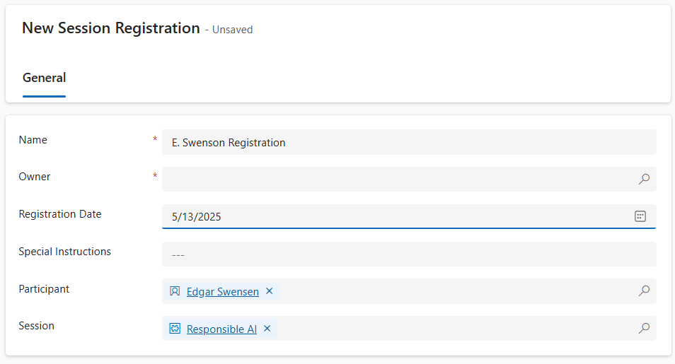

---
lab:
  title: "Laboratorio\_6: Crear un flujo de Power\_Automate."
  learning path: 'Learning Path: Demonstrate the capabilities of Microsoft Power Automate'
  module: 'Module 2: Build a Microsoft Power Automate flow'
---

## Objetivo de aprendizaje

En este ejercicio, los alumnos crearán una serie de flujos de nube diferentes mediante Microsoft Copilot en Power Automate. Usará diferentes métodos de creación como Copilot y desde cero para familiarizarse con las diferentes opciones disponibles.

Tras completar correctamente este ejercicio, hará lo siguiente:

- Uso de mensajes de lenguaje natural para diseñar flujos de trabajo
- Configuración de desencadenadores y acciones
- Pruebe la automatización para un uso práctico.

### Escenario

Contoso Consulting es una organización de servicios profesionales especializada en servicios de consultoría de TI e IA. A lo largo del año, ofrecen muchos eventos diferentes a sus clientes. Algunos de estos son eventos tipo ferias comerciales en los que participan muchos socios que proporcionan información sobre nuevos productos, tendencias del mercado y servicios. Otros se producen durante todo el año y son seminarios web rápidos que se usan para proporcionar detalles sobre los productos individuales. Además, Contoso está empezando a usar agentes automatizados para ayudar a los clientes con preguntas.

Contoso quiere usar Power Automate para crear un flujo de confirmación de registro que enviará un correo electrónico automatizado a un cliente cuando se registre para un evento. 

En este ejercicio, va a crear una serie de flujos de Power Automate en función de criterios específicos.

Antes de comenzar este ejercicio, debe haber completado los siguientes laboratorios:

- **Laboratorio 2: Creación de un modelo de datos**
- **Laboratorio 5: Compilación de una aplicación basada en modelo**

El tiempo estimado para completar este ejercicio es de 20 a 30 minutos.

## Ejercicio 1: Creación de un flujo de notificación de registro de sesión

En este primer ejercicio, va a crear un flujo que se ejecutará automáticamente cuando se cree un nuevo registro de sesión. Obtendrá los detalles de la sesión, el evento y el contacto que se ha registrado y le enviará un correo electrónico con los detalles de su registro.

### Tarea 1: Creación de un flujo

Queremos enviar una confirmación de registro a los usuarios recién registrados. Crearemos un flujo que capturará los detalles de un registro y enviará un correo electrónico de confirmación al usuario registrado.

1. Vaya a [https://make.powerautomate.com](https://make.powerautomate.com/).

1. Es posible que deba volver a autenticarse: seleccione **Iniciar sesión** y siga las instrucciones si es necesario.

1. Seleccione el entorno **Dev One** en la parte superior derecha si aún no lo ha hecho. (Importante, no olvide realizar este paso).

1. En el panel de navegación izquierdo, seleccione **+ Crear**. (Si se le solicita, seleccione **Comenzar**).

1. Seleccione **Flujo de nube automatizado**.

1. Escriba `Registration Notification` en **Nombre de flujo**.

1. En **Elegir el desencadenador del flujo**, busque `Dataverse`.

1. Seleccione el desencadenador **Cuando se agrega, modifica o elimina una fila** y, luego, elija **Crear**.

    Si ve un error de **parámetros no válidos**, esto se debe a que no se ha autenticado. Siga los pasos que se indican a continuación para crear una conexión. 
    - Seleccione **Cambiar conexión**.
    - Seleccione **Agregar nuevo**.
    - En el campo **Nombre de la conexión**, escriba **Administrador de MOD**. Deje el **tipo de autenticación** como **OAuth** y seleccione **Iniciar sesión**.
    - Una vez que haya iniciado sesión, vaya al **paso 9.** 

1. Rellene las condiciones del desencadenador para el flujo:

    - Seleccione **Agregado** **Cambiar tipo**.
    - Seleccione **Registros de sesión** para **Nombre de tabla.**
    - En **Ámbito**, seleccione **Organización** en el paso del desencadenador. 

1. Cambie el nombre del paso del desencadenador por `When a Session Registration is added`.

    

Esta es una buena manera de que tú y otros editores de flujo puedan comprender el propósito de la etapa sin tener que profundizar en los detalles.

### Tarea 2: Cree un paso para obtener los detalles de la sesión de eventos para la que está el registro.

1. Seleccione **+ New step**(+ Nuevo paso). 

1. Busque **Obtener una fila por identificador**. 

1. Seleccione la acción **Obtener una fila por id.** .

1. Seleccione **Sesiones de eventos** como **Nombre de tabla.**

1. Seleccione el campo **Id. de fila**. Observe que los iconos aparecen para seleccionar **Contenido dinámico** o **Expresiones**.

1. En el campo **Id. de fila**, seleccione **Sesión de eventos (valor)** en la lista **Contenido dinámico**. En este paso, busque la **Sesión de eventos** para el **Registro de sesión** que se creó para desencadenar este flujo.

1. En la acción **Obtener una fila por identificador**. Cambiar el nombre de la acción `Get the Event Session`

    

    A continuación, vamos a obtener los detalles del evento en el que se encuentra la sesión.

1. En el paso **Obtener sesión de eventos**, seleccione **+ Insertar acción.**

1. Busque **Obtener una fila por identificador**. 

1. Seleccione la acción **Obtener una fila por id.** .

1. Seleccione **Eventos** como **Nombre de tabla.**

1. Seleccione el campo **Id. de fila**. Observe que los iconos aparecen para seleccionar **Contenido dinámico** o **Expresiones**.

1. En el campo **id. de fila**, seleccione **Evento (valor)** de la lista de **Contenido dinámico**. En este paso, busque el **Evento** para la **Sesión de evento** que se capturó en el paso anterior.

1. En la acción **Obtener una fila por identificador**. Cambia el nombre de la acción `Get the Event`

    

    Por último, vamos a obtener los detalles de la persona registrada para la sesión.

1. En Obtener detalles del evento, establezca **Insertar nueva acción**.

1. En el campo de búsqueda, escriba **Obtener una fila por identificador**.

1. Seleccione **Obtener una fila por identificador**.

1. Seleccione **Contactos** como **Nombre de tabla**.

1. Seleccione el campo **Id. de fila**. Observe que se abre una ventana para seleccionar **Contenido dinámico** o **Expresiones**.

1. En el campo **Id. de fila**, seleccione el campo **Participante (valor)** en el desencadenador **Cuando se agrega un registro de sesión** desde la lista **Contenido dinámico**.

1. Seleccione el texto **Obtener una fila por identificador** y cambie el nombre de esta acción por `Get Participant Details`.

    

### Tarea 3: Creación de un paso para enviar un correo electrónico para confirmar el registro de sesión

1. En el paso **Obtener detalles del participante**, seleccione **Insertar nueva acción**.

1. En el campo de búsqueda, escriba **Enviar un correo electrónico**.

1. Seleccione **Enviar un correo electrónico (V2)**.

    Es posible que se le pida que cree una conexión a Outlook, si es así, seleccione el botón **Iniciar sesión** e inicie sesión con la cuenta de **Administrador MOD**. 

    

1. Justo encima del campo **Para**, seleccione el icono **Engranaje**. En el menú que aparece, seleccione **Usar contenido dinámico**.

     

1. Con los valores dinámicos, en el campo **Para**, seleccione **Correo electrónico** en **Obtener detalles del participante**.

    

1. En el campo **Asunto**, asegúrese de que indica `Registration Confirmation`.

1. Escribe el siguiente texto en el **cuerpo del correo electrónico**:

    > **Nota:** El contenido dinámico debe colocarse donde se nombran los campos entre paréntesis. Se recomienda copiar y pegar todo el texto primero y, luego, agregar contenido dinámico en los lugares correctos.

    *`Dear {First Name}, Thank you for registering for our upcoming session {Session Name} on {Event Date}. {Speaker} will be your speaker in this session. Your session is scheduled to last {Duration (Hours)}. Check out our other session at our {Event Name}.`*

    *`Best regards,`*

    *`Events Administration`*
    
    *`Contoso Consulting`*

    A continuación, vamos a reemplazar el texto entre corchetes por los elementos que se describen a continuación.

1. Resalta el texto **{First Name}**. Reemplácelo por el campo **Nombre** del paso **Obtener detalles del participante**.

1. Resalte el texto **{Nombre de sesión}**. Reemplácelo por el campo **Nombre de sesión** del paso **Obtener sesión de eventos**.

1. Resalte el texto **{Fecha de evento}**. Reemplácelo por el campo **Fecha de evento** del paso **Obtener detalles del evento**.

1. Resalte el texto **{Ponente}**. Reemplácelo por el campo **Ponente (Valor)** del paso **Obtener sesión de eventos**.

1. Resalte el texto {**Duración (horas)}**. Reemplácelo por el campo **Duración (horas)** del paso **Obtener sesión de eventos**.

1. Resalte el texto **{Nombre de evento}**. Reemplácelo por el campo **Nombre de evento** del paso **Obtener detalles del evento**.

    El paso completado debe ser similar a la imagen:

    

1. Seleccione **Guardar**.

    Deja esta pestaña de flujo abierta para la siguiente tarea. El flujo debe tener un aspecto similar al siguiente:

### Tarea 4: Escriba algunos datos de ejemplo.

> **Nota:** Si completó el laboratorio 5: creación de una aplicación controlada por modelos, puede omitir esta tarea y pasar directamente a la tarea 5. 

1. Con el panel de navegación de la izquierda, seleccione **Aplicaciones**.

1. Cambie las aplicaciones que se muestran en **Mis aplicaciones** a **Todas**.

1. Mantenga el puntero sobre la aplicación **Administración de eventos** y seleccione el icono **Reproducir**.

1. Con el panel de navegación de la izquierda, seleccione **Contactos**.

1. En la barra de comandos, selecciona el botón **+ Nuevo**.

1. En la pantalla **Nuevo contacto**, configure de la siguiente manera:

    - **Nombre:** Suzanne

    - **Apellidos:** Diaz

    - **Puesto:** Ingeniero

1. En el encabezado del formulario, seleccione la flecha hacia abajo situada junto a **Tipo de contacto**.

1. Establezca el **Tipo de contacto** en **Ponente**.
    

1. Seleccione el botón **Guardar** para guardar el contacto y déjelo abierto.

1. Seleccione el botón **+ Nuevo**.

1. En la pantalla **Nuevo contacto**, configure de la siguiente manera:

    - **Nombre:** Edgar

    - **Apellidos:** Swenson

    - **Puesto:** Arquitecto

    - **Correo electrónico:** Escriba la dirección de correo electrónico (IMPORTANTE o el flujo no se ejecutará)

1. En el encabezado del formulario, seleccione la flecha hacia abajo situada junto a **Tipo de contacto**.

1. Establezca el **Tipo de contacto** en **Participante**.

1. Selecciona el botón **Guardar &amp; cerrar**.

    A continuación, vamos a agregar un nuevo evento.

1. Con el panel de navegación de la izquierda, seleccione **Eventos**.

1. En la barra de comandos, selecciona el botón **+ Nuevo**.

1. En la pantalla **Nuevo evento**, use la siguiente configuración:

    - **Nombre de evento:** Conferencia de primavera.

    - **Fecha de evento:** Fecha de mañana.

    - **Núm. máx. de asistentes:** 500

    - **Detalles del evento:** Conferencia de primavera para presentar los productos y servicios más recientes de nuestros proveedores asociados.

    - **Tipo de evento:** Conferencia

    - **Ubicación**: Seattle

    - **Es necesario registrarse:** Sí/verdadero

    

1. Selecciona el botón **Guardar &amp; cerrar**.

    A continuación, agregaremos una nueva sesión para el evento.

1. Con el panel de navegación de la izquierda, seleccione **Sesiones de eventos**.

1. Seleccione el botón **+ Nuevo**.

1. Configure la **Sesión de eventos** de la siguiente manera:

    - **Nombre de sesión:** IA responsable

    - **Fecha de sesión:** Fecha de mañana

    - **Duración:** 1,5 horas

    - **Descripción de la sesión:** Con todas las nuevas soluciones de inteligencia artificial, ser responsables es importante. Analizaremos los desafíos.

    - **Ponente:** Suzanne Diaz

    - **Evento:** Conferencia de primavera

    

1. Seleccione el botón **Guardar y cerrar**.

 
### Tarea 5: Validar y probar el flujo

1. Si es necesario, abra una nueva pestaña en el explorador y vaya a [https://make.powerapps.com](https://make.powerapps.com/). 

1. Selecciona el entorno **Dev One** en la parte superior derecha si aún no lo has hecho.

1. Seleccione **Aplicaciones** y abra la **aplicación de administración de eventos de Contoso**.

1. Deja esta pestaña del explorador abierta y vuelve a la pestaña anterior con el flujo.

1. En la barra de comandos, selecciona **Probar**. Selecciona **Manualmente** y, luego, **Probar**.

1. Ve a la pestaña del explorador con la aplicación basada en modelo abierta.

    Por último, vamos a crear un **Registro de sesión**.

1. Con el panel de navegación de la izquierda, seleccione **Registros de sesión.**

1. En la **Barra de comandos**, seleccione **+ Nuevo**.

1. Complete el registro de sesión de la manera siguiente:

    - **Nombre**: `E, Swenson Registration`.

    - **Fecha del registro:** Fecha de hoy

    - **Participante:**`Edgar Swenson`

    - **Sesión:**`Responsible AI`

    

1. Seleccione el botón **Guardar y cerrar**.

1. Ve a la pestaña del explorador donde se ejecuta la prueba del flujo. Después de un breve retraso, deberías ver el flujo en ejecución. Aquí es donde puedes detectar cualquier problema en el flujo o confirmar que se ha ejecutado correctamente.

Transcurrido un breve intervalo de tiempo, deberías ver un correo electrónico en la bandeja de entrada.

> **Nota:** podría ir a la carpeta Correo no deseado.
