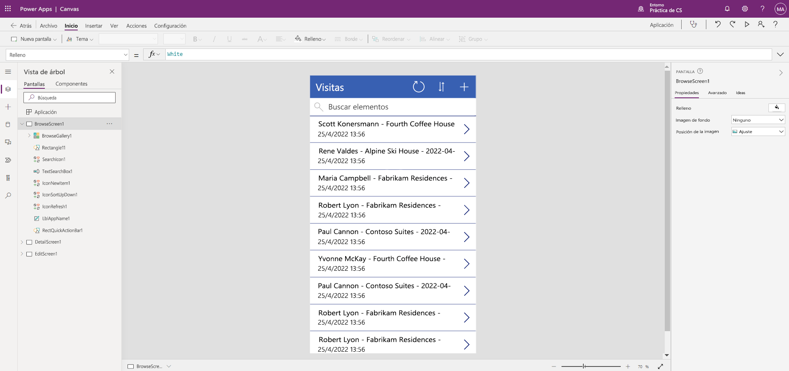

---
lab:
  title: "Laboratorio\_2: Cómo crear una aplicación de lienzo"
  module: 'Module 3: Get started with Power Apps'
---

# Laboratorio 2: Cómo crear una aplicación de lienzo

**Inquilinos de WWL: términos de uso** Si, como parte de la impartición de un curso dirigido por un instructor, se le proporciona un inquilino, tenga en cuenta que el inquilino está disponible para apoyar los laboratorios prácticos en este tipo de cursos. Los inquilinos no deben compartirse ni usarse para otros fines que no sean los de los laboratorios prácticos. El inquilino usado en este curso es un inquilino de prueba y no se puede usar ni tener acceso a él después de que la clase haya terminado y no sea apto para la extensión. Los inquilinos no se deben convertir a suscripciones de pago. Los inquilinos obtenidos como parte de este curso siguen siendo propiedad de Microsoft Corporation y nos reservamos el derecho de acceso y recuperación en cualquier momento. 

## Escenario

Bellows College es una institución educativa que tiene un campus con varios edificios. Actualmente se guarda un registro físico de las visitas al campus. La información no se recaba de manera uniforme y no hay forma de recopilar y analizar los datos sobre las visitas de todo el campus.

Actualmente, la administración del campus utiliza una hoja de cálculo de Excel para realizar un seguimiento del registro de visitantes. Le gustaría modernizar el sistema de registro de visitantes de los edificios cuyo acceso esté controlado por el personal de seguridad y en los que los anfitriones deban anotar con antelación las visitas y dejar constancia de ellas.

A lo largo de este curso, creará aplicaciones y realizará la automatización para permitir que el personal de administración y seguridad de Bellows College administre y controle el acceso a los edificios en el campus.

## Pasos de alto nivel del laboratorio

Seguiremos el siguiente esquema para diseñar la aplicación de lienzo:

- Creación de una aplicación de lienzo a partir de datos en la tabla Visita

- Configurar cómo se muestran las visitas en la pantalla de exploración

- Realizar algunos cambios básicos en la aplicación

- Probar la funcionalidad de la aplicación

## Prerrequisitos

- Finalización del **Módulo 0 Laboratorio 0: Validación del entorno de laboratorio**
- Finalización del **Módulo 2 Laboratorio 1: Modelado de datos**

## Ejercicio 1: Crear una aplicación de lienzo Visitas

**Objetivo:** En este ejercicio, creará una aplicación de lienzo mediante la conexión de la tabla Visit que creó anteriormente.

### Tarea \#1: Crear la aplicación Visitas

1.  Vaya a <https://make.powerapps.com>. Es posible que deba volver a autenticarse: seleccione **Iniciar sesión** y siga las instrucciones si es necesario.

2.  Seleccione su ambiente **Práctica [mis iniciales]** en la parte superior derecha, si aún no está seleccionado.

3.  Seleccione **+Crear** en el panel de navegación izquierdo de la pantalla. En la sección **Iniciar desde**, seleccione **Dataverse**.

4.  Seleccione la conexión de Dataverse.

    > **Nota:**  *Si no existe ninguna conexión de Dataverse:*
    > - Selección de **+Nueva conexión**
    > - Busque **Microsoft Dataverse**
    > - Seleccione **Crear**
    > - **Inicie sesión** y seleccione **Permitir acceso**.

5.  Busque y seleccione la tabla **Visitas** que creó en el laboratorio anterior.

6.  Seleccione el botón **Conectar** en la esquina inferior derecha.

7.  Una vez creada la aplicación, en la pantalla de bienvenida a Power Apps Studio, active la casilla **No volver a mostrar** y, luego, seleccione **Omitir**.

8.  Después de que se ha completado la creación, la aplicación de lienzo debe ser similar a la imagen siguiente:

    

9.  En el diseñador de aplicaciones, seleccione el botón **Vista previa de la aplicación** (icono de reproducción) en la barra de comandos. *(También puede obtener una vista previa de la aplicación pulsando F5).* Eche un vistazo y compruebe el aspecto de su aplicación.

10. Cierre la vista previa de la aplicación seleccionando la **X** de la esquina superior derecha de la pantalla.

Enhorabuena, ha creado correctamente una instancia de Power App a partir de una tabla de Dataverse. El siguiente paso del proceso es adaptar la aplicación para que se ajuste a la personalización de marca de Bellows College. La siguiente serie de pasos le guiará por el proceso de personalizar un poco más la aplicación.

### Tarea \#2: Modificar y aplicar un tema a la nueva aplicación

En esta tarea, personalizará el texto del encabezado en cada una de las tres pantallas de la aplicación (Examinar, Detalles y Editar) y cambiará el tema de la aplicación. 

1.  Está en la pantalla Examinar. Seleccione la etiqueta **Visitas** en la pantalla.

1.  En el lado derecho de la pantalla, en la pestaña Propiedades, actualice la propiedad de control **Texto** a `Bellows College Visits`.

1.  En **Propiedades**, cambie el **tamaño de la fuente** a **24**. 

1.  Seleccione el fondo en blanco de la pantalla para ver el texto actualizado en la pantalla de exploración. 

1.  Mediante la **vista de árbol** del panel de navegación izquierdo, seleccione **DetailScreen1**. 

1.  Seleccione la etiqueta **Visitas** en la pantalla.

1.  En el lado derecho de la pantalla, en la pestaña **Propiedades**, actualice la propiedad de control **Texto** a `Visit Details`.

1.  Haga clic en el fondo en blanco de la pantalla para ver el texto actualizado en la pantalla de detalles.

1.  Mediante la **vista de árbol** del panel de navegación izquierdo, seleccione **EditScreen1** (es posible que tenga que desplazarse hacia abajo para verlo en esa vista).

1.  Seleccione la etiqueta **Visitas** en la pantalla.

1.  En el lado derecho de la pantalla, en la pestaña **Propiedades**, reemplace el texto de la propiedad de control **Texto** por `Edit Details`.

1.  Haga clic en el fondo en blanco de la pantalla para ver el texto actualizado en la pantalla de edición.

1.  Mediante la **vista de árbol** del panel de navegación izquierdo, seleccione **BrowseScreen1**.

1.  En la barra de herramientas de comandos, seleccione el botón **Tema** y, en la lista que aparece, elija el color **Rojo** para el tema.

### Tarea \#3: Probar la aplicación de visitas

En esta tarea, probará la nueva aplicación.

1.  Con la aplicación abierta en el Diseñador de aplicaciones, seleccione **Configuración**, en la sección **General**, actualice el nombre de la aplicación a `Visits App`, seleccione la **X** para cerrar la pantalla de configuración y, luego, elija **Guardar**.

2.  En el panel de navegación izquierdo, seleccione **BrowseScreen1**.

3.  En el diseñador de aplicaciones, seleccione el botón **Vista previa de la aplicación** (icono de reproducción) en la barra de comandos. *(También puede obtener una vista previa de la aplicación presionando F5).*

4.  Una vez que se abra la aplicación, en el campo **Buscar elementos**, escriba el texto `Maria`Maria
     *(observe cómo se filtran los elementos de la galería en función de lo que se escribe en el campo de búsqueda).*

5.  Cuando se muestre el registro **Contoso Suites** para **Maria Campbell**, seleccione una fila para ir a la pantalla de detalles de esa visita y abrirla. (**Nota**: *Si se muestra más de un registro Contoso Suites para Maria Campbell, seleccione cualquiera de ellos*).

6.  Para editar el registro, seleccione el **icono de lápiz** en la esquina superior derecha de la aplicación.

7.  Aquí puede editar el **nombre de la visita** y seleccionar el icono de **marca de verificación** de la parte superior derecha para guardar el cambio.

8.  En la parte superior derecha de la pantalla, seleccione el icono de la **X** para cerrar el modo de vista previa y volver al editor de aplicaciones de lienzo.

Felicidades. Ha creado y configurado su primera aplicación de lienzo.

