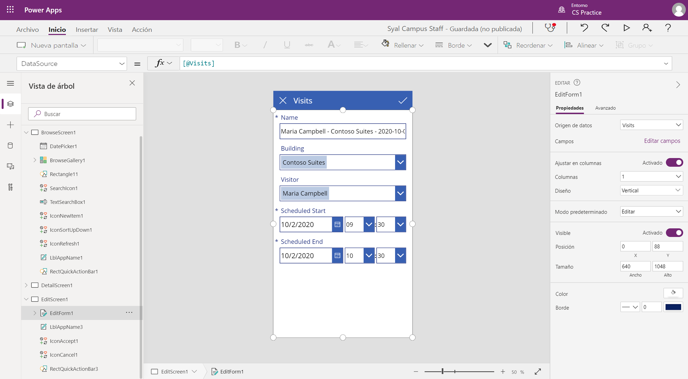
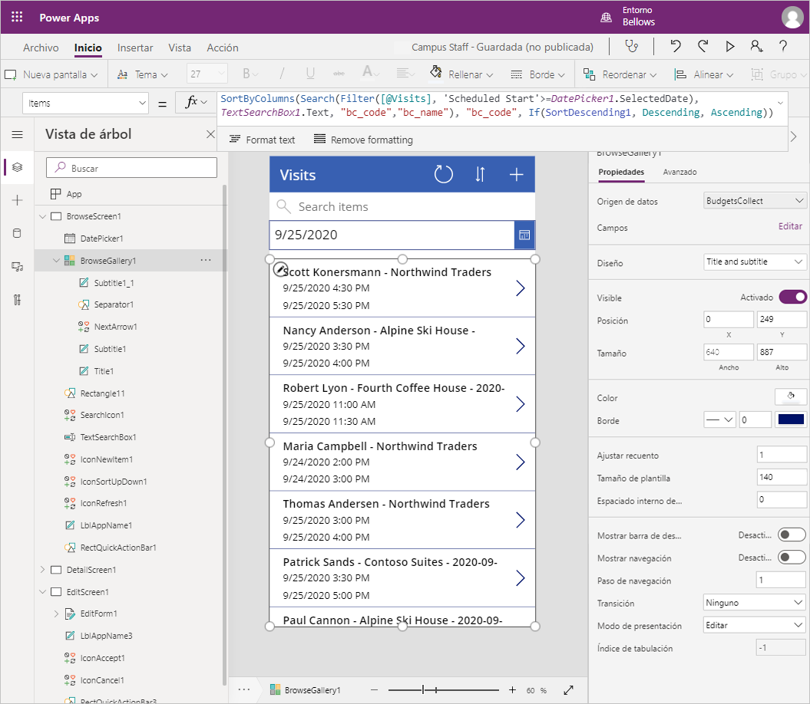

---
lab:
  title: 'Laboratorio 2: Cómo crear una aplicación de lienzo, parte 1'
  module: 'Module 3: Get started with Power Apps'
ms.openlocfilehash: ac6cec75309098dae7715c0bdf42db75c9b80429
ms.sourcegitcommit: ef58c858463b890e923ef808b1d43405423943fd
ms.translationtype: HT
ms.contentlocale: es-ES
ms.lasthandoff: 01/27/2022
ms.locfileid: "137899020"
---
# <a name="module-3-get-started-with-power-apps"></a>Módulo 3: Introducción a Power Apps

## <a name="lab-how-to-build-a-canvas-app-part-1"></a>Laboratorio: Cómo crear una aplicación de lienzo, parte 1

# <a name="scenario"></a>Escenario

Bellows College es una institución educativa que tiene un campus con varios edificios. Actualmente se guarda un registro físico de las visitas al campus. La información no se recaba de manera uniforme y no hay forma de recopilar y analizar los datos sobre las visitas de todo el campus. 

La administración del campus querría modernizar el sistema de registro de visitantes de los edificios cuyo acceso esté controlado por el personal de seguridad y en los que los anfitriones deban anotar con antelación las visitas y dejar constancia de ellas.

A lo largo de este curso, creará aplicaciones y realizará la automatización para permitir que el personal de administración y seguridad de Bellows College administre y controle el acceso a los edificios en el campus.  

En la parte 1 de este laboratorio, diseñará una aplicación de lienzo de Power Apps que el personal de la universidad pueda usar para administrar las visitas de sus invitados.

# <a name="high-level-lab-steps"></a>Pasos de alto nivel del laboratorio

Seguiremos el siguiente esquema para diseñar la aplicación de lienzo:

-   Crear la aplicación a partir de datos utilizando la plantilla de factor de forma del teléfono
-   Configure una página de detalles con información de la visita.
-   Configure una página de edición para crear para las visitas.
-   Configure un control de galería para mostrar las visitas.
-   Agregar filtros en el origen de datos de la galería para mostrar solo visitas futuras

## <a name="prerequisites"></a>Prerrequisitos

* Finalización del **Módulo 0 Laboratorio 0: Validación del entorno de laboratorio**
* Finalización del **Módulo 2 Laboratorio 1: Introducción a Microsoft Dataverse**

## <a name="things-to-consider-before-you-begin"></a>Cuestiones que tener en cuenta antes de comenzar

-   ¿Cuál es el factor de forma más frecuente para el público objetivo?
-   Estimar el número de registros en el sistema 
-   Cómo reducir los registros seleccionados para mejorar el rendimiento de la aplicación y la adopción del usuario

# <a name="exercise-1-create-staff-canvas-app"></a>Ejercicio \#1: Crear una aplicación de lienzo del personal

**Objetivo:** En este ejercicio, creará una aplicación de lienzo a partir de una plantilla y, luego, la modificará para incluir los datos necesarios

## <a name="task-1-create-canvas-app"></a>Tarea \#1: Crear una aplicación de lienzo

En esta tarea, creará una aplicación de lienzo utilizando la plantilla de diseño de teléfono basada en Microsoft Dataverse. Usando Visitas como una tabla seleccionada de Dataverse, la plantilla generará la aplicación Galería: Ver: Editar para administrar las visitas al campus.

1.  Comenzar a crear una aplicación a partir de datos

    -   Inicie sesión en <https://make.powerapps.com>.

    -   Seleccione su **entorno** en la parte superior derecha, si aún no está establecido en su entorno Práctica.

    -   Seleccione el icono **Dataverse** dentro de **Iniciar a partir de datos** en la pantalla principal.

2.  Conectarse a la tabla Visitas
    
    -   Seleccione **+ Nueva conexión**.

    -   Seleccione **Microsoft Dataverse** y haga clic en **Crear**.

    -   Busque y seleccione la tabla **Visitas**.

    -   Seleccione **Conectar**.

3.  Puede que aparezca la ventana **Bienvenido a Power Apps Studio**. Haga clic en **Omitir**.

4.  Guardar aplicación

    -   Haga clic en **Archivo \> Guardar**.

    -   Escriba [Su apellido] Personal del campus como el **Nombre de la aplicación**.

    -   Presione **Save**(Guardar).

## <a name="task-2-configure-visits-detail-form"></a>Tarea \#2: Configurar el formulario Detalles de visitas

En esta tarea, configurará un formulario de detalles para ver información sobre los registros de visitas individuales.

1. Seleccione la flecha **Atrás** en la parte superior izquierda para volver a la definición de la aplicación.

2. Expanda **DetailScreen1** debajo de **Vista de árbol**.

3.  Seleccione **DetailForm1**.

4.  Seleccione **Editar campos** al lado de **Campos** en el panel derecho.

5.  Haga clic en **Agregar campo**

6.  Seleccione estos campos:

    * Finalización real
    
    * Inicio real
    
    * Compilación 
    
    * Código
    
    * Final programado
    
    * Scheduled Start
    
    * Visitante
    
7.  Haga clic en **Agregar**.

8.  Reorganice los campos en el panel **Campos** arrastrando y soltando los nombres de campo hacia arriba o hacia abajo. El orden recomendado es:
    * Código, Nombre, Edificio, Visitante, Inicio programado, Final programado, Inicio real, Final real
    >**Sugerencia:** Puede contraer cada campo haciendo clic en la flecha que hay junto a sus respectivos nombres.

9.  Quite el campo **Creado el**. Para ello, haga clic en los puntos suspensivos ( **...** ) junto al nombre del campo y seleccione **Quitar**. 

10.  Cierre el panel **Campos**.
 
11.  Para conservar el trabajo en curso, haga clic en **Archivo** y, a continuación, pulse **Guardar**. Utilice la flecha hacia atrás para volver a la aplicación.

## <a name="task-3-configure-visits-edit-form"></a>Tarea \#3: Configurar el formulario de edición de visitas

En esta tarea, configurará un formulario para editar información sobre las filas de visitas individuales.

1.  Expanda **EditarPantalla1** debajo de **Vista de árbol**.

2.  Seleccione **EditForm1**.

3.  Seleccione el campo **Creado en** y presione la tecla **Supr** para quitar el campo

4.  Seleccione **Editar campos** en el panel de propiedades

5.  Haga clic en **Agregar campo**

6.  Seleccione estos campos:

    * Compilación 
    
    * Final programado
    
    * Scheduled Start
    
    * Visitante
    
7.  Haga clic en **Agregar**.

8.  Reorganice los campos en el panel **Campos** arrastrando y soltando los nombres de campo hacia arriba o hacia abajo. El orden recomendado es:
    
    * Nombre, Edificio, Visitante, Inicio programado, Fin programado
    >**Sugerencia:** Puede contraer cada campo haciendo clic en la flecha que hay junto a sus respectivos nombres. 

9.  Cierre el panel **Campos**.

10.  Para conservar el trabajo en curso, haga clic en **Archivo** y, a continuación, pulse **Guardar**. Utilice la flecha hacia atrás para volver a la aplicación.

Su pantalla debería tener un aspecto similar a este:



## <a name="task-4-configure-visits-gallery"></a>Tarea \#4: Configurar la galería de visitas

En esta tarea, configurará la galería pregenerada para mostrar el título y las fechas de inicio y finalización de la visita. 

1.  Expandir **BrowseScreen1** debajo de **Vista de árbol**

2.  Seleccione **BrowseGallery1**.

3.  Seleccione la propiedad **TemplateSize** en el panel Propiedades avanzadas de la derecha.

4.  Reemplace la expresión por la siguiente `Min(150, BrowseGallery1.Height - 60)`. Eso asegurará suficiente espacio para información adicional.

5.  En la vista previa de la aplicación, seleccione el campo Fecha y hora en la galería.

6.  En la barra de fórmulas en la parte superior, cambie **ThisItem.'Created on'** a `ThisItem.'Scheduled Start'`.

7.  Seleccione el campo de nuevo

8.  Presione **CTRL-C** y, luego, **CTRL-V** para crear una copia del campo.

9.  Con el ratón o el teclado, mueva el control copiado hacia abajo y alinéelo con los otros controles de la galería, debajo del otro campo Fecha y hora.

10.  En la barra de fórmulas en la parte superior, cambie **ThisItem.'Scheduled Start'** a `ThisItem.'Scheduled End'`.

11.  Para conservar el trabajo en curso, haga clic en **Archivo** y, a continuación, pulse **Guardar**. Utilice la flecha hacia atrás para volver a la aplicación.

## <a name="task-5-add-date-filter"></a>Tarea 5: Agregar filtros de fecha

Debido a que el número de visitas crece continuamente, los usuarios necesitan una función para filtrar la galería de visitas. Por ejemplo, el usuario puede querer ver solo las visitas futuras. En esta tarea, agregará la capacidad de mostrar visitas solo después de una fecha seleccionada por el usuario.

1. Seleccione **BrowseScreen1**

2. Seleccione el menú **Insertar** en la parte superior.

3. Haga clic en **Entrada** y seleccione **Selector de fecha**.

4. Usando el teclado o el mouse, coloque el control debajo del cuadro de búsqueda.

5. Seleccione **BrowseGallery1**. 

6. Cambie el tamaño y mueva el control de la galería para que se encuentre debajo del selector de fecha y cubra la pantalla. Puede hacer esto haciendo clic en el icono de cambio de tamaño en el centro superior del control de la galería y cambiando el tamaño del control para que comience después del selector de fecha.

7. Con **BrowseGallery1** seleccionado, haga clic en la pestaña **Avanzadas** del panel Propiedades.

8. Busque la propiedad **Items** y haga clic en el cuadro de texto.

9. En la expresión, busque **[@Visits]** y reemplácela por `Filter(Visits,'Scheduled End' >= DatePicker1.SelectedDate)`. La expresión completa debería ser como la siguiente:

   ```
   SortByColumns(
    Search(
        Filter(
            Visits,
            'Scheduled End' >= DatePicker1.SelectedDate
           ),
           TextSearchBox1.Text,
        "bc_code","bc_name"
       ),
     "bc_scheduledstart",
     If(SortDescending1, Descending, Ascending)
   )
   ```
   
10. Para conservar el trabajo en curso, haga clic en **Archivo** y, a continuación, pulse **Guardar**. Utilice la flecha hacia atrás para volver a la aplicación.

Su pantalla debería tener un aspecto similar a este:



# <a name="exercise-2-complete-the-app"></a>Ejercicio 2: Completar la aplicación

En este ejercicio probará la aplicación y, una vez que tenga éxito, la agregará a su solución.

## <a name="task-1-test-app"></a>Tarea \#1: Probar aplicación

1.  Inicio de la aplicación

    -   Seleccione **BrowseScreen1** y presione Función **F5**, o haga clic en el icono **Reproducir** en la esquina superior derecha para obtener una vista previa de la aplicación.
    
    -   La aplicación debe cargar y mostrar una lista de visitas. 
    
    -   Pruebe el filtro seleccionando diferentes fechas en el control del selector de fechas
    
    -   Seleccione una visita y compruebe que el formulario de visualización funcione correctamente
    
    -   Regrese a la galería y pulse **+** para crear una nueva visita. Compruebe que el formulario de edición contenga las columnas obligatorias, incluidos los visitantes, el edificio y las fechas de inicio y finalización programadas.
    
    -   Rellene la información y envíela. Compruebe que el nuevo registro aparezca en la galería.
    
    -   Cree al menos 2 visitas más.
    
    -   Presione la tecla **ESC** o haga clic en el icono **X** para cerrar el modo de vista previa.

2.  Guarde y publique la aplicación

    -   Haga clic en **Archivo** y, si se muestra el botón Guardar, haga clic en **Guardar**.

    -   Haga clic en **Publicar**.

    -   Haga clic en **Publicar esta versión**.

    -   Haga clic en la flecha **Atrás** para volver a la aplicación.

    -   Cierre la ventana o pestaña del explorador **Diseñador**.

    -   Haga clic en **Salir** si se le solicita cuando intenta cerrar la ventana del explorador.

## <a name="task-2-add-app-to-solution-and-publish"></a>Tarea n.°2: Agregar aplicación a la solución y publicar 

1. Abra la solución de Administración del campus.

   * Inicie sesión en <https://make.powerapps.com>.
   
   * Si el Entorno que se muestra en la parte superior derecha no es su Entorno de práctica, seleccione su **Entorno**. 
   
   * Seleccione **Soluciones**.
   
   * Haga clic para abrir la solución de **Administración del campus**.
   
2. Seleccione **Agregar existente**, luego haga clic en **Aplicación** y luego haga clic en **Aplicación de lienzo**.

3. Seleccione la pestaña **Fuera de Dataverse**.

4. Seleccione la aplicación **Personal del campus**, haga clic en **Agregar**.

5. Seleccione **Publicar todas las personalizaciones**.

# <a name="challenges"></a>Desafíos

* Vista del calendario de todas las visitas y filtrado por intervalo de fechas
* Capacidad para crear y administrar contactos como parte de la aplicación
* Cómo mostrar varias reuniones durante una sola visita

