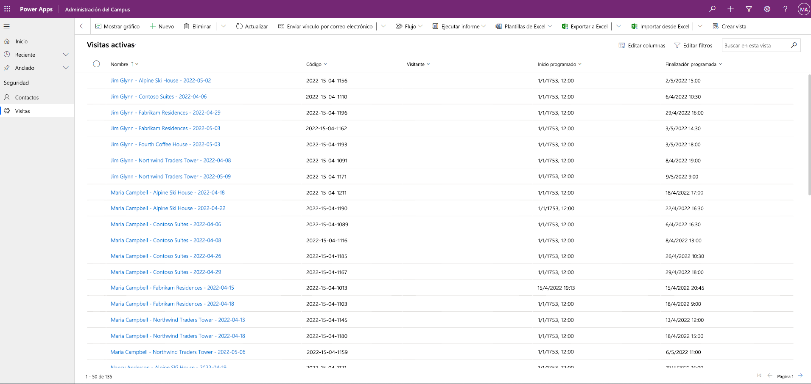

---
lab:
  title: 'Laboratorio 3: Cómo crear una aplicación basada en modelo'
  module: 'Module 3: Get started with Power Apps'
ms.openlocfilehash: c69ca883cc8f8c8b00ed3f67fb18f93b035726e3
ms.sourcegitcommit: 50e1a519a6893e02a4a0c2c6bef93cafd2513611
ms.translationtype: HT
ms.contentlocale: es-ES
ms.lasthandoff: 07/14/2022
ms.locfileid: "147125766"
---
# Módulo 3: Introducción a Power Apps
## Laboratorio: Cómo crear una aplicación basada en modelo

# Escenario

Bellows College es una institución educativa que tiene un campus con varios edificios. Los visitantes del campus están actualmente registrados en revistas en papel. La información no se recaba de manera uniforme y no hay forma de recopilar y analizar los datos sobre las visitas de todo el campus.

La administración del campus querría modernizar el sistema de registro de visitantes de los edificios cuyo acceso esté controlado por el personal de seguridad y en los que los anfitriones deban anotar con antelación las visitas y dejar constancia de ellas.

A lo largo de este curso, creará aplicaciones y realizará la automatización para permitir que el personal de administración y seguridad de Bellows College administre y controle el acceso a los edificios en el campus.

En este laboratorio, creará una aplicación impulsada por el modelo de Power Apps para permitir que el personal del campus administrativo administre los registros de visitas en todo el campus.

Pasos de alto nivel del laboratorio

Como parte de la creación de la aplicación basada en modelo, completará lo siguiente:

- Cree una nueva aplicación basada en modelo llamada Administración del campus

- Editar la navegación de la aplicación para hacer referencia a las tablas requeridas

- Personalizar los formularios y las vistas de las tablas necesarias para la aplicación

Trabajaremos con los siguientes componentes:

- **Vistas**: Las vistas permiten al usuario mostrar los datos existentes en la tabla del formulario.

- **Formularios**: Aquí es donde el usuario crea/actualiza nuevas filas en las tablas.

Ambos se integrarán a la aplicación basada en modelo para una mejor experiencia de usuario.

Prerrequisitos

- Haber realizado el **módulo 0, laboratorio: Validación del entorno de laboratorio**

- Haber realizado el **módulo 2, laboratorio: Modelado de datos**

- Haber realizado el **módulo 3, laboratorio: Cómo crear una aplicación de lienzo**

Cuestiones que tener en cuenta antes de comenzar

- ¿Qué cambios debemos hacer para mejorar la experiencia del usuario?

- ¿Qué deberíamos incluir en una aplicación basada en modelo elaborada según el modelo de datos que hemos construido?

- ¿Qué personalizaciones se pueden hacer en el mapa del sitio de una aplicación basada en modelos?

Ejercicio n.º 1: Personalizar las vistas y formularios

**Objetivo:** En este ejercicio, personalizará las vistas y formularios de las tablas creadas de manera personalizada que se utilizarán en la aplicación basada en modelo.

Tarea n.° 1: Editar el formulario de visita

1. Haga clic en [https://make.powerapps.com](https://make.powerapps.com/) si aún no ha iniciado sesión.

2. Seleccione su ambiente **Práctica [mis iniciales]** en la parte superior derecha, si aún no está seleccionado.

3. Con el panel de navegación de la izquierda, expanda **Dataverse**, seleccione **Tablas** y haga clic para abrir la tabla **Visitas**.

Si no ve la tabla Visita, asegúrese de que se encuentra en el entorno correcto (paso 2).

4. En las secciones Experiencias de datos, seleccione **Formularios** y haga clic para abrir el formulario Información con el tipo de formulario **Principal**.

**IMPORTANTE:** Dado que, de forma predeterminada, todos los formularios se denominan Información, asegúrese de comprobar que el formulario que selecciona sea del tipo de formulario **Principal** y no cualquier otro. Por defecto, el formulario tiene dos campos: Nombre (campo principal) y Propietario.

5. En el lado derecho de la pantalla, en el panel Propiedades, seleccione el campo **Nombre para mostrar** y cámbielo a **Información principal**.

6. Con el menú de la parte superior de la pantalla, seleccione el **campo + Formulario** y agregue los siguientes campos debajo del campo **Propietario**. Para ello, arrastre las columnas hasta el formulario o simplemente haga doble clic en los nombres de las columnas:

    0. **Visitante**

    1. **Inicio programado**

    2. **Final programado**

    3. **Inicio real**

    4. **Finalización real**

7. Arrastre la columna **Código** y suéltela en el encabezado del formulario.

El encabezado está en la parte superior derecha del formulario. Es posible que deba contraer el panel Propiedades en el lado derecho de la pantalla para ver el campo en el formulario.

8. Con el campo **Código** seleccionado, marque la casilla de verificación **Solo lectura** en el panel Propiedades del lado derecho de la pantalla.

9. Seleccione el campo **Propietario**. En el panel Propiedades, cambie la **Etiqueta** a **Host**.

10. Haga clic en **Guardar** en la parte superior derecha y espere a que se termine de guardar.

11. Haga clic en **Publicar** en la parte superior derecha y espere hasta que se complete la publicación.

12. Si la vista de edición se abre en una nueva pestaña o ventana del explorador, ciérrela. De lo contrario, haga clic en **Atrás** en la parte superior izquierda de la pantalla. Ahora debe estar de nuevo en la pestaña Formularios de la tabla Visita.

13. Usar las rutas de navegación de la parte superior izquierda (Tablas>Visitar>Formularios). Seleccione **Visitar** para volver a la pantalla principal de la tabla **Visit**. 

Tarea n.°2: Editar la vista de visitas activas

En esta tarea, modificaremos la vista predeterminada de Visitas activas y crearemos una nueva vista para las visitas de hoy.

1. En la sección Experiencias de datos, seleccione **Vistas** y haga clic para abrir la vista **Visitas activas**.

2. Agregue los siguientes campos a la vista haciendo clic o arrastrando y soltando los campos:

    0. **Código**

    1. **Visitante**

    2. **Inicio programado**

    3. **Final programado**

3. Haga clic en la columna **Creado en** y seleccione **Quitar**. El campo **Creado en** ahora se eliminará de la vista.

4. Cambie el tamaño de los anchos de las columnas individuales para que los datos entren.

5. Haga clic en **Guardar** y espere hasta que se guarden los cambios.

6. Haga clic en **Publicar** y espere a que se complete la publicación.

Tarea n.° 3: Crear una vista nueva para las visitas de hoy

Ahora clonaremos la vista para crear una nueva vista para las visitas de hoy.

IMPORTANTE: Asegúrese de que no cierra la vista Visitas activas, ya que la aprovecharemos para crear la nueva vista de visitas de hoy. 

1. Haga clic en la **flecha desplegable** situada junto al botón Guardar (tenga cuidado de no presionar el botón) y seleccione **Guardar como**.

2. Cambie el nombre a **Visitas de hoy** y presione **Guardar**.

3. Haga clic en el vínculo **Editar filtros** en el panel Propiedades.

4. Haga clic en **Agregar**, seleccione **Agregar fila**.

5. Seleccione **Inicio programado** como campo y, luego, **Hoy** como condición en el menú desplegable.

6. Haga clic en **…** en la fila **Estado** y haga clic en **Eliminar** para eliminar esa condición de filtro.

7. Presione **Aceptar** para guardar la condición. La vista ahora está filtrada para mostrar solo los registros donde la fecha de inicio programada es hoy.

8. Agregue los campos **Comienzo real** y **Final real** a la vista.

**Nota:** Como ya no filtramos el estado de la vista, obtendremos todas las visitas de hoy, incluidas las completadas. Estos campos ayudarán a diferenciar visitas completadas y visitas en curso.

1. Haga clic en **Save**(Guardar).

2. Haga clic en **Publicar** y espere a que se complete la publicación.

Ejercicio 2: Crear una aplicación basada en modelos

**Objetivo:** En este ejercicio, creará la aplicación basada en modelos, personalizará el mapa del sitio y probará la aplicación.

Por motivos de simplicidad y tiempo, no abordaremos algunas de las columnas de visitas de este laboratorio.

Tarea n.° 1: Crear una aplicación

1. Haga clic en [https://make.powerapps.com](https://make.powerapps.com/) (si aún no ha iniciado sesión).

2. Seleccione su ambiente **Práctica [mis iniciales]** en la parte superior derecha, si aún no está seleccionado.

3. Cree una aplicación basada en modelos:

    0. Seleccione **Aplicación vacía** en la sección **Iniciar desde** de la pantalla de inicio.

    1. En **Aplicación vacía basada en Dataverse**, seleccione **Crear**.

    2. Escriba **Administración del campus de Bellows** en Nombre y seleccione **Crear**.

4. Una vez que se cargue la nueva aplicación controlada por modelos, seleccione el botón **+ Agregar página**.

5. En la pantalla Agregar página, elija **Vista y formulario basados en tablas** y, a continuación, seleccione el botón **Siguiente**.

6. Agregue las tablas siguientes:

    0. Visite

    1. Contacto

7. Después de seleccionar las 2 tablas, seleccione **Agregar**.

8. Con los iconos de navegación del panel izquierdo de la pantalla, seleccione **Navegación**.

9. En el panel de navegación, seleccione el **Grupo 1** debajo de Barra de navegación.

10. En el lado derecho de la pantalla, en la sección **Opciones de presentación**, cambie la propiedad **Título** a **Seguridad**.

Tarea n.°2: Editar la aplicación

Ahora que tenemos todos los componentes necesarios agregados a la aplicación controlada por modelos, organizaremos los elementos.

1. En el panel de navegación, en el grupo de seguridad, seleccione **SubArea1**.

2. Seleccione la **Elipsis** y, en el menú que aparece, seleccione eliminar **SubArea1**.

3. Con la navegación del panel izquierdo de la pantalla, seleccione **Páginas**.

4. Busque y expanda **Visita** en el panel Páginas.

5. Seleccione **Formulario de visita**.

6. En la parte derecha de la pantalla, seleccione **Agregar formulario**.

7. Seleccione el formulario **Información principal**.

8. En **Visita** en el panel Páginas, seleccione **Vista de visita**.

9. En la parte derecha de la pantalla, seleccione **Agregar vista**.

10. Seleccione la vista **Visitas de hoy**.

11. Vuelva a seleccionar **Agregar vista**. 

12. Seleccione la vista **Visitas activas**. 

13. Seleccione **Guardar**.

14. Una vez completada la operación **Guardar**, seleccione el botón **Publicar** para publicar los cambios.

Tarea n.° 3: Probar la aplicación

1. Inicio de la aplicación

    0. Seleccione **Reproducir** para abrir la aplicación en una ventana nueva.

2. Crear un nuevo contacto

    0. La aplicación debería abrirse en la vista **Mis contactos activos**. Si no es así, seleccione Contactos a la izquierda.

    1. Haga clic en **Nuevo** en el menú superior.

    2. Proporcione el **Nombre de pila** como Juan y **Apellido** como Pérez.

    3. Proporcione su correo electrónico personal como **Correo electrónico**. Esto se usará en un laboratorio futuro donde recibirá un correo electrónico.

    4. Haga clic en **Guardar y cerrar**.

    5. Ahora debería ver el contacto creado en la vista **Contactos activos**.

3. Crear una nueva visita

    0. Seleccione **Visitas** del mapa del sitio.

    1. Haga clic en **Nueva**.

    2. Especifique los campos de la siguiente forma

        0. **Nombre**: Nueva visita de prueba

        1. **Visitante**: seleccione John Doe

        2. **Inicio programado**: seleccione la fecha de mañana y las 02:00 como hora de inicio.

        3. **Final programado**: seleccione la fecha de mañana y las 03:30 como hora de finalización.

- Haga clic en **Guardar y cerrar**. Esto creará el registro de la visita y debería poder verlo en la vista Visitas activas.

- Cambie la vista a **Visitas de hoy**. Ya no debería ver la nueva visita en la vista, ya que está programada para mañana.

4. Puede agregar más registros de prueba.

Su aplicación en ejecución debería verse aproximadamente como la siguiente:

Felicidades. Ha creado y configurado la primera aplicación basada en modelo.

# Desafíos

-   Seleccione vistas y formularios específicos para Contactos
