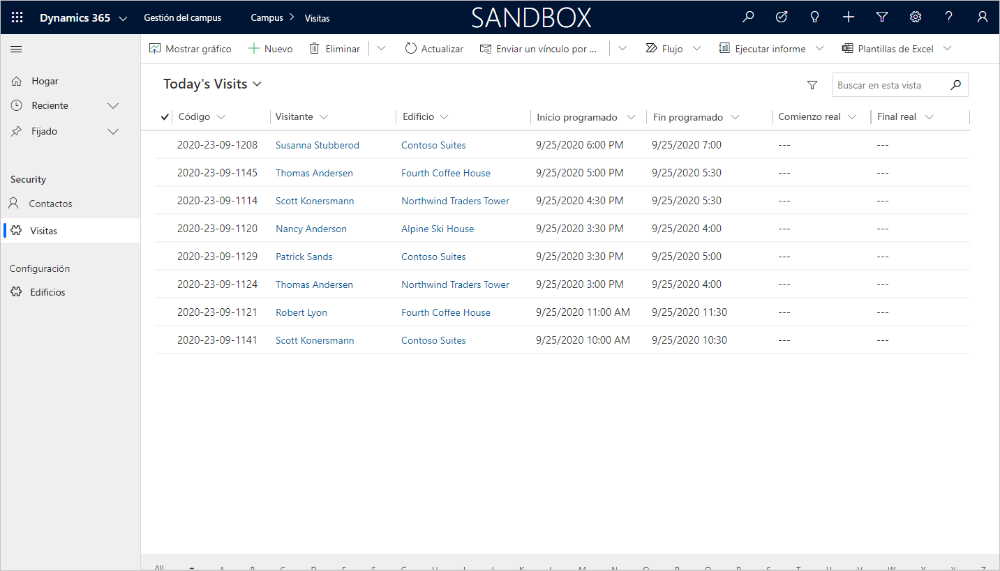

---
lab:
    title: 'Laboratorio 4: Creación de una aplicación basada en modelo'
    module: 'Módulo 3: Comience con Power Apps'
---

# Módulo 3: Introducción a Power Apps
## Laboratorio 3: Cómo crear una aplicación basada en modelo

### Aviso importante (noviembre de 2020):
Desde noviembre de 2020, Common Data Service se llama Microsoft Dataverse. Algunos de los términos de Microsoft Dataverse se han modificado. Por ejemplo, entidad (a partir de ahora **tabla**), campo (a partir de ahora **columna**) y registro (a partir de ahora **fila**) pueden estar desactualizados. Tenga esto en cuenta a la hora de utilizar los laboratorios. Esperamos actualizar todo el contenido lo antes posible.

Si quiere obtener más información o quiere ver una lista de los términos modificados, consulte [¿Qué es Microsoft Dataverse?](https://docs.microsoft.com/en-us/powerapps/maker/common-data-service/data-platform-intro#terminology-updates)

# Escenario

Bellows College es una institución educativa que tiene un campus con varios edificios. Los visitantes del campus están actualmente registrados en revistas en papel. La información no se recaba de manera uniforme y no hay forma de recopilar y analizar los datos sobre las visitas de todo el campus. 

La administración del campus querría modernizar el sistema de registro de visitantes de los edificios cuyo acceso esté controlado por el personal de seguridad y en los que los anfitriones deban anotar con antelación las visitas y dejar constancia de ellas.

A lo largo de este curso, creará aplicaciones y realizará la automatización para permitir que el personal de administración y seguridad de Bellows College administre y controle el acceso a los edificios en el campus. 

En este laboratorio, creará una aplicación impulsada por el modelo de Power Apps para permitir que el personal del campus administrativo administre los registros de visitas en todo el campus.

# Pasos de alto nivel del laboratorio

Como parte de la creación de la aplicación basada en modelo, completará lo siguiente:

-   Cree una nueva aplicación basada en modelo llamada Administración del campus

-   Editar la navegación de la aplicación para hacer referencia a las tablas requeridas

-   Personalizar los formularios y las vistas de las tablas necesarias para la aplicación

Trabajaremos con los siguientes componentes:

- **Vistas**: Las vistas permiten al usuario mostrar los datos existentes en la tabla del formulario.

- **Formularios**: Aquí es donde el usuario crea/actualiza nuevas filas en las tablas.

Ambos se integrarán a la aplicación basada en modelo para una mejor experiencia de usuario.

## Requisitos previos

* Finalización del **Módulo 0 Laboratorio 0: Validación del entorno de laboratorio**
* Finalización del **Módulo 2 Laboratorio 1: Introducción a Microsoft Dataverse**

## Cuestiones que tener en cuenta antes de comenzar

-   ¿Qué cambios debemos hacer para mejorar la experiencia del usuario?

-   ¿Qué deberíamos incluir en una aplicación basada en modelo elaborada según el modelo de datos que hemos construido?
    
-   ¿Qué personalizaciones se pueden hacer en el mapa del sitio de una aplicación basada en modelos?

# Ejercicio 1: Personalice vistas y formularios

**Objetivo:** En este ejercicio, personalizará las vistas y formularios de las tablas creadas de manera personalizada que se utilizarán en la aplicación basada en modelo.

## Tarea 1: Edite el formulario de visita

1.  Regístrese en <https://make.powerapps.com> si aún no lo ha hecho.

2.  Seleccione su **entorno.**

3.  Seleccione **Soluciones**.

4.  Haga clic para abrir la solución de **Administración del campus**.

5.  Haga clic para abrir la entidad **Visita**.

6.  Seleccione la pestaña **Formularios** y seleccione para abrir el tipo de formulario **Principal**. 

    > Por defecto, el formulario tiene dos campos: Nombre (campo principal) y Propietario.
    
7.  Seleccione el **campo + Formulario** y agregue los siguientes campos debajo del campo **Propietario**. Para ello, arrastre las columnas hasta el formulario o simplemente haga doble clic en los nombres de las columnas:

    * **Edificio**
    * **Visitante**
    * **Inicio programado**
    * **Final programado**
    * **Inicio real**
    * **Final real** 
    
8.  Arrastre la columna **Código** y suéltela en el encabezado del formulario. 

    > El encabezado está en la parte superior derecha del formulario. Es posible que deba minimizar el panel Propiedades en el lado derecho de la pantalla para ver el campo en el formulario.

9.  Con el campo **Código** seleccionado, marque la casilla de verificación **Solo lectura** en el panel Propiedades.

10.  Seleccione el campo **Propietario**. En el panel Propiedades, cambie la **Etiqueta de campo** a **Host**.

11.  Haga clic en **Guardar** en la parte superior derecha y espere a que se termine de guardar.

12.  Haga clic en **Publicar** en la parte superior derecha y espere hasta que se complete la publicación.

13.  Haga clic en **Atrás** en la parte superior izquierda de la pantalla. Debería estar de vuelta en la
     entidad Visita de la pestaña Forms.

## Tarea 2: Edite las vistas de visita

En esta tarea, modificaremos la vista predeterminada de Visitas activas y crearemos una nueva vista para las visitas de hoy.

1.  Seleccione la pestaña **Vistas** y haga clic para abrir la vista **Visitas activas**.

2.  Agregue los siguientes campos a la vista haciendo clic o arrastrando y soltando los campos:

    *  **Código**
    *  **Visitante**
    *  **Edificio**
    *  **Inicio programado** 
    *  **Final programado**
    
3.  Haga clic en la columna **Creado en** y seleccione **Quitar**. El campo **Creado en** ahora se eliminará de la vista.

4.  Haga clic en la columna **Nombre** y seleccione **Quitar**. El campo **Nombre** ahora se eliminará de la vista.

5.  En el panel de Propiedades a la derecha, haga clic en **Ordenar por...** y seleccione **Inicio programado**. Haga clic en **Inicio programado** nuevamente para cambiar el orden a descendente.

6.  Cambie el tamaño de los anchos de las columnas individuales para que los datos entren.

7.  Haga clic en **Guardar** y espere hasta que se guarden los cambios.

8.  Haga clic en **Publicar** y espere a que se complete la publicación.

Ahora clonaremos la vista para crear una nueva vista para las visitas de hoy.

9.  Presione el enlace **Editar filtros** en el panel Propiedades.

10.  Haga clic en **Añadir**, seleccione **Añadir fila**.

11.  Seleccione **Inicio programado** como campo y, luego, **Hoy** como condición en el menú desplegable. 

12.  Haga clic en **[...]** en la fila **Estado** y haga clic en **Eliminar**. 

13.  Presione **Aceptar** para guardar la condición. La vista ahora está filtrada para mostrar solo los registros donde la fecha de inicio programada es hoy.

14.  Agregue los campos **Comienzo real** y **Final real** a la vista. 

> **Nota:** Como ya no filtramos el estado de la vista, obtendremos todas las visitas de hoy, incluidas las completadas. Estos campos ayudarán a diferenciar visitas completadas y visitas en curso.

15.  Haga clic en la **flecha desplegable** situada junto al botón Guardar (tenga cuidado de no presionar el botón) y seleccione **Guardar como**.

16.  Cambie el nombre a **Visitas de hoy** y presione **Guardar**.

17.  Haga clic en **Publicar** y espere a que se complete la publicación.

# Ejercicio 2: Cree una aplicación basada en modelos

**Objetivo:** En este ejercicio, creará la aplicación basada en modelos, personalizará el mapa del sitio y probará la aplicación.

> Verá varios campos que no se abordan a medida que desarrolla su aplicación, particularmente en los pasos del mapa del sitio. Hemos tomado algunos atajos para hacer los laboratorios. En una implementación real, le daría a estos elementos nombres lógicos.

## Tarea 1: Crear una aplicación

1.  Abra la solución Administración del campus si aún no está en ella.

    -   Inicie sesión en <https://make.powerapps.com>

    -   Mientras esté en su entorno, haga clic para abrir la solución de **Administración del campus**.
    
2.  Crear una aplicación basada en modelos

    -   Haga clic en **Nuevo**, seleccione **Aplicación** y luego **Aplicación basada en modelo**. Esta acción abrirá una nueva ventana.
    
    -   Escriba **[Su apellido] Administración del campus** como Nombre.

    -   Seleccione la casilla **Usar solución existente para crear la aplicación**.

    -   Seleccione **Siguiente**.

    -   Seleccione la solución **Administración del campus**.
    
    -   Haga clic en **Listo**.
    
3.  Haz clic en el ícono de lápiz junto al **Mapa del sitio**

4.  Editar los títulos predeterminados

    -   Seleccione **Nueva área**.

    -   Cambie el título de la nueva área a **Campus** en el panel de propiedades a la derecha.

    -   Seleccione **Nuevo grupo**.

    -   Cambie el título del nuevo grupo a **Seguridad** en el panel de propiedades a la derecha.
    
5.  Agregar la tabla Contacto al mapa del sitio.

    -   Seleccione **Nueva subárea**.

    -   En el panel **Propiedades**, seleccione **Entidad** del menú desplegable.
        para **Tipo**.

    -   Busque la tabla **Contacto** del menú desplegable para **Entidad**.
    
6.  Agregar la tabla Visita al mapa del sitio

    -   Seleccione el grupo **Seguridad** y haga clic en **Agregar**.

    -   Seleccione **Subárea**.

    -   Vaya al panel **Propiedades**.

    -   Seleccione **Entidad** del menú desplegable para **Tipo** y busque
        la tabla **Visita** del menú desplegable en **Entidad**.
    
7.  Agregar la tabla Edificio al mapa del sitio

    -   Seleccione el área **Campus** y haga clic en **Agregar**.
    
    -   Seleccione **Grupo**.
    
    -   Entre **Configuraciones** para **Título** en el panel **Propiedades**.
    
    -   Con el grupo **Configuración** seleccionado, haga clic en **Agregar**.
    
    -   Seleccione **Subárea**.
    
    -   Vaya al panel **Propiedades**.
    
    -   Seleccione **Entidad** del menú desplegable para **Tipo** y busque la tabla **Edificio** del menú desplegable para **Entidad**.

8.  Haga clic en **Guardar**. Esto mostrará la pantalla de carga mientras se guardan los cambios.

9.  Haga clic en **Publicar** todas las personalizaciones y espere a que se complete la publicación.

10.  Haga clic en **Guardar y cerrar** para cerrar el mapa de sitio. 

    > Verá que los activos de las entidades que se agregaron al mapa del sitio ahora están en la aplicación.
     
11.  Haga clic en **Guardar** en el diseñador de Apps.

12.  Haga clic en **Validar** para validar los cambios realizados en la aplicación. 

>  Esto mostrará algunas advertencias, pero podemos ignorarlas, ya que no hemos hecho referencia a una Vista y un Formulario específicos para las entidades, y los usuarios tendrán acceso a todas las Vistas y Formularios para las entidades **Visitar** y **Edificio**.
     
13. Haga clic en **Publicar**.

14.  Haga clic en **Guardar y cerrar** para cerrar el diseñador de la aplicación.

15.  Haga clic en **Listo**.

16.  Seleccione **Soluciones** y luego **Publicar todas las personalizaciones.**

17.  Seleccione **Aplicaciones** y su aplicación ahora debería estar en la lista.

## Tarea 2: Aplicación de prueba

1.  Inicie la aplicación

    -   Seleccione **Aplicaciones** y haga clic en su aplicación **Administración del campus**. (Si no ve su aplicación, es posible que deba actualizar el explorador).

    -   La aplicación debería abrirse en una nueva ventana.
    
2.  Crear un nuevo contacto

    -   La aplicación debería abrirse en la vista **Contactos activos**.

    -   Haga clic en **Nuevo** en el menú superior.

    -   Establezca el **Nombre** como `John` y el **Apellido** como `Doe`.

    -   Proporcione su correo electrónico personal como **Correo electrónico**. Esto se utilizará en un laboratorio futuro. 
    
    -   Haga clic en **Guardar y cerrar**.

    -   Ahora debería ver el contacto creado en la vista **Contactos activos**.
    
3.  Crear un nuevo edificio

    -   Seleccione **Edificios** en el mapa del sitio.

    -   Haga clic en **Nuevo**.

    -   Escriba el **Nombre** como `Microsoft Building`.
        
    -   Haga clic en **Guardar y cerrar**. Esto mostrará en nuevo registro que acaba de crear en
        la vista de Edificios activos.
    
4.  Crear una nueva visita

    -   Seleccione **Visitas** del mapa del sitio.
    
    -   Haga clic en **Nuevo**.
    
    -   Especifique los campos de la siguiente forma 
    
        -   **Nombre**:  `New test visit`
        -   **Edificio**: seleccione Edificio de Microsoft
        -   **Visitante**: seleccione John Doe
        -   **Inicio programado**: seleccione la fecha de mañana y las 02:00 como hora de inicio.
        -   **Final programado**: seleccione la fecha de mañana y las 03:30 como hora de finalización.
        
    -   Haga clic en **Guardar y cerrar**. Esto creará el registro de la vista y debería poder verlo en la
        Vista de visitas activas.
        
    -   Cambie la vista a **Visitas de hoy**. Ya no debería ver la nueva visita en la vista, ya que está programada para mañana.
    
5. Puede agregar más registros de prueba.

   Su aplicación en ejecución debería verse aproximadamente como la siguiente:

# Desafíos

* Seleccione vistas y formularios específicos para Visitas y Edificios
* El personal de seguridad generalmente trabaja en un solo edificio. ¿Cómo les proporcionaría una manera fácil de mostrar visitas solo para un edificio seleccionado?
* Restringir el acceso a entidades específicas, por ejemplo, los edificios deben ser de solo lectura para todos los miembros del personal, excepto los administradores.
* ¿Qué paneles consideraría agregar a la aplicación?
