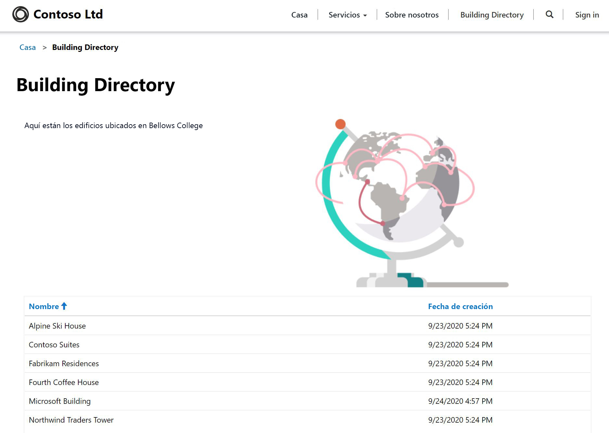

---
lab:
    title: 'Laboratorio 5: Cómo crear un portal de Power Apps'
    module: 'Módulo 3: Comience con Power Apps'
---

# Módulo 3: Introducción a Power Apps

## Laboratorio 4: Cómo crear un portal de Power Apps

# Escenario

Bellows College es una institución educativa que tiene un campus con varios edificios. Actualmente se guarda un registro físico de las visitas al campus. La información no se recaba de manera uniforme y no hay forma de recopilar y analizar los datos sobre las visitas de todo el campus.

La administración del campus desea proporcionarles a los visitantes información sobre los edificios del campus. Los visitantes podrán ver la lista de edificios en un sitio web, que se creará utilizando un portal de Power Apps.

En este laboratorio, aprovisionará un portal de Power Apps y creará una página web de portales que mostrará una lista de los edificios del campus.

# Pasos de alto nivel del laboratorio

Seguirá el siguiente esquema para diseñar el portal de Power Apps:

* Aprovisionar un portal de Power Apps en el ambiento de Dataverse
* Crear y configurar una página web para mostrar una lista de los edificios
* Crear un tema nuevo y aplicarlo al portal

## Requisitos previos

* Finalización del **Módulo 0 Laboratorio 0: Validación del entorno de laboratorio**
* Finalización del **Módulo 2 Laboratorio 1: Introducción a Microsoft Dataverse**

## Cuestiones que tener en cuenta antes de comenzar

* Las aplicaciones de los portales de Power Apps siempre se inician desde una plantilla en lugar de una aplicación en blanco. Su portal debería haberse creado en el Laboratorio 0 del Módulo 0. Una vez que aprovisione un portal, ya tendrá páginas, menús y un tema predeterminado. 

# Ejercicio 1: Crear una página web de portal

**Objetivo:** En este ejercicio, creará una nueva página web que mostrará contenido estático, así como una lista de edificios de Dataverse.

## Tarea 1: Ir al portal

1.  Vaya a <https://make.powerapps.com>.

2.  Compruebe que está en su ambiente de práctica. Si no es así, cambie el entorno en la esquina superior derecha.

3.  Haga clic en **Aplicaciones**.

4.  Busque la aplicación que tiene el **Tipo** de **Portal**.

5.  Haga clic en el nombre de la aplicación para abrir el portal.

    > Esto debería redirigirle a la página de aterrizaje del sitio web de su portal, en la que habrá un mensaje de bienvenida. Vaya a su portal para ver los contenidos que se crearon de forma predeterminada cuando aprovisionó el portal. 

## Tarea 2: Crear una página web

1.  Abrir portales de Power Apps Studio

    -   Inicie sesión en <https://make.powerapps.com> (todavía puede tener esto abierto en sus pestañas)

    -   Seleccione **Aplicaciones**.
    
    -   Busque la aplicación que tiene el **Tipo** de **Portal**.

    -   Haga clic en los puntos suspensivos (**...**) a la derecha del nombre de la aplicación del portal y seleccione **Editar**.

    > Ahora se encuentra en los portales de Power Apps Studio. Aquí es donde puede modificar y crear contenido del portal.

2.  Crear una nueva página.

    -   En la barra de comandos, seleccione **Nueva página.**

    - Seleccione **Página de aterrizaje**

3.  En el panel Propiedades bajo **Mostrar**, cambie el **Nombre** de **Página nueva (1)** a `Building Directory`.

4.  En la **URL parcial**, cambie el valor a `building-directory` y pulse la tecla Tabulación (para iniciar el guardado automático).

    > El título de la página ahora debería leerse **Directorio de edificios**
    
## Tarea 3: Agregar contenido estático

1.  Agregue una sección a la página web

    - En el lienzo (área que muestra la página web), seleccione una sección de la página que no sea una columna.

    -   En el cinturón de herramientas (lado izquierdo), seleccione el icono **Componentes**

    -   Escoja **Sección de dos columnas** desde el área **Diseño de sección**

2.  Agregar texto estático

    -   En el lienzo (área que muestra la página web), seleccione la columna de la izquierda

    -   En el cinturón de herramientas (lado izquierdo), seleccione el icono **Componentes**

    -   Escoja **Texto** desde el área **Componentes del portal**

    -   En la nueva área de texto, escriba lo siguiente:
          ```
          The following is the building directory.
          ```
    -   Seleccione el cuadro de texto sobre el que acaba de editar y haga clic en **Eliminar** en la barra de comandos para eliminar el texto predeterminado.

3. Agregar una imagen

    -   En el lienzo (área que muestra la página web), seleccione la columna de la derecha

    -   En el cinturón de herramientas (lado izquierdo), seleccione el icono **Componentes**

    -   Elija **Imagen** desde el área **Componentes del portal**

    - En el panel Propiedades, haga clic en **Seleccionar una imagen**. Busque y seleccione **Pages.png**
    
    -   En el panel Propiedades, haga clic en el menú desplegable de la sección **Formato** y cambie el **Ancho** al 70 % (asegúrese de escribir el %). Puede jugar con el tamaño de la imagen hasta que quede como desee.

4.  Configure los derechos para mostrar la lista de edificios 

    -   En el menú de la izquierda, haga clic en Configuración (símbolo de engranaje) y elija **Ver más opciones de configuración**. Esta acción abrirá opciones de configuración adicionales en una pestaña nueva.

    -   En el menú de la izquierda, desplácese a **Seguridad** y seleccione **Permisos de tabla**.

    -   Haga clic en **Nuevo** y agregue los valores siguientes:

        -   **Nombre**: mostrar lista de edificios
        -   **Nombre de la tabla**: en el menú desplegable de la derecha, seleccione Edificio (bc_building)
        -   **Sitio web**: haga clic en la lupa y seleccione el sitio web (Visitantes de Bellows: [su nombre])
        -   **Tipo de acceso**: global
        -   **Privilegios**: lectura
    
    -   En el menú superior, seleccione **Guardar**.
    
    -   Desplácese hasta la sección **Roles web** y **Agregar rol web existente**.
    
    -   Haga clic en la lupa, seleccione **Usuarios anónimos** y haga clic en **Agregar**.
    
    -   En el menú superior, seleccione **Guardar y cerrar**.
    
    -   Vuelva a la pestaña anterior.

5.  Haga clic en **Navegar por el sitio web** para ver la página hasta ahora.  Fíjese que ahora en el menú principal aparece la opción **Directorio de edificios**.

    > Es posible que deba configurar su explorador para permitir las ventanas emergentes.

## Tarea 4: Agregar un componente de lista

1.  Vaya a la pestaña anterior y continúe con el paso 2. Si no está disponible, siga los pasos a continuación para regresar a esta ubicación.

    -   Inicie sesión en <https://make.powerapps.com> (todavía puede tener esto abierto en sus pestañas)

    -   Busque la aplicación que tiene el **Tipo** de **Portal**.

    -   Haga clic en los puntos suspensivos (**...**) y elija **Editar**
    
    -   En el cinturón de herramientas (lado izquierdo), elija la opción **Páginas** 

    -   Busque y seleccione la página **Directorio de edificios** que creó anteriormente
    
2.  Agregar un componente de lista a la página Directorio de edificios

    -   Seleccione la sección con dos columnas.

    -   En el cinturón de herramientas (lado izquierdo), seleccione el icono **Componentes**

    -   Elija **Sección de una columna** desde el área **Diseño de sección** (aparecerá una sección debajo de la imagen y el texto en la página web)

    -   Seleccione la nueva sección de columna en el lienzo

    -   En el cinturón de herramientas (lado izquierdo), seleccione el icono **Componentes**

    -   Elija **Lista** desde el área **Componentes del portal** (aparecerá un componente de lista en la nueva sección)
    
3.  Configure el componente de lista

    -   Seleccionar el componente de lista en el lienzo

    -   En el panel Propiedades (lado derecho), escriba `Buildings List` en el campo **Nombre**.

    -   En el campo **Tabla**, seleccione **Edificios (bc_edificio)** en la lista desplegable.

    -   En **Vistas**, elija **Edificios activos**.

    -   Deje la configuración predeterminada restante
    
4.  Haga clic en **Navegar por el sitio web** para ver la página. 

    > Debería ver la lista de Edificios de base de datos de Dataverse aparecer en la página web.

# Ejercicio 2: Cambiar el tema del portal

**Objetivo:** En este ejercicio, creará un nuevo tema que alterará el esquema de color de su portal. 

## Tarea 1: Aplicar y editar un tema

1.  Vaya a la pestaña anterior y continúe con el paso 2. Si no está disponible, siga los pasos a continuación para regresar a esta ubicación.

    -   Inicie sesión en <https://make.powerapps.com> (todavía puede tener esto abierto en sus pestañas)

    -   Busque la aplicación que tiene el **Tipo** de **Portal**.

    -   Haga clic en los puntos suspensivos (**...**) y elija **Editar**
    
2.  Aplicar y personalizar un tema básico

    -   En el cinturón de herramientas (lado izquierdo), seleccione el icono **Temas**.
    
    - Asegúrese de que el botón de alternancia de **Habilitar tema básico** esté activado.
    
    -   En uno de los ajustes preestablecidos, haga clic en los puntos suspensivos(**...**) y elija **Personalizar**
    
    -   Se ha creado una copia del tema básico. 
    
    -   En el panel Propiedades, pruebe cambiar los colores y explore el impacto de estos cambios en el portal.
    
    -   Cambiar el nombre de su tema
    
3.  En la barra de comandos, haga clic en **Configuración de sincronización**.

El diseño de la aplicación debería ser similar a la estructura siguiente:



# Desafíos

* Cree una vista diferente de edificios que solo muestre el nombre del edificio. Necesitará seleccionar **Navegar por el sitio web** desde el portal Studio para ver los cambios.
* En el cinturón de herramientas, haga clic en el icono **Temas** y edite el CSS del tema personalizado.
* Cree una página con el componente **Formulario** y modifique un componente de **Lista** para agregar o editar filas de Dataverse con el formulario.
* Habilite **Permisos de entidad** en **Configuración** de un componente **Lista**. ¿Qué pasa con los datos?
* En el portal de Studio, seleccione el icono del Editor de código fuente `</>` para ver el origen de la página. Si se siente cómodo con HTML, haga algunas modificaciones y vea los resultados.
