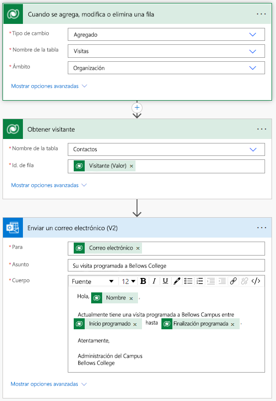

---
lab:
  title: 'Laboratorio 4: Cómo crear una solución automatizada'
  module: 'Module 4: Get Started with Power Automate'
ms.openlocfilehash: 35d4b6940f31e1a2aef5e8b43d8ca7007e1b72f2
ms.sourcegitcommit: 8a89b7eacd1a65eaa7c5d6bff0dc7254991c4dde
ms.translationtype: HT
ms.contentlocale: es-ES
ms.lasthandoff: 07/15/2022
ms.locfileid: "147154328"
---
# Laboratorio 4: Cómo crear una solución automatizada

## Escenario

Bellows College es una institución educativa que tiene un campus con varios edificios. Los visitantes del campus están actualmente registrados en revistas en papel. La información no se recaba de manera uniforme y no hay forma de recopilar y analizar los datos sobre las visitas de todo el campus.

La administración del campus querría modernizar el sistema de registro de visitantes de los edificios cuyo acceso esté controlado por el personal de seguridad y en los que los anfitriones deban anotar con antelación las visitas y dejar constancia de ellas.

A lo largo de este curso, creará aplicaciones y realizará la automatización para permitir que el personal de administración y seguridad de Bellows College administre y controle el acceso a los edificios en el campus.

En este laboratorio, creará un flujo de Power Automate para enviar un correo electrónico a un visitante cuando se programe una visita.

## Pasos de alto nivel del laboratorio

Se han identificado las siguientes condiciones como requisitos que debe implementar para completar el proyecto:

- Los contactos deben recibir una notificación por correo electrónico cuando se programe una visita.

## Prerrequisitos

- Finalización del **Módulo 0 Laboratorio 0: Validación del entorno de laboratorio**
- Finalización del **Módulo 2 Laboratorio 1: Modelado de datos**
- Finalización del **Módulo 2 Laboratorio 3: Cómo crear una aplicación basada en modelo**
- Contacto John Doe creado con una dirección de correo electrónico personal

## Ejercicio 1: Crear flujo de notificación de visita

**Objetivo:** En este ejercicio, creará un flujo de Power Automate que implementa el requisito. Cuando se crea una visita, el visitante debe recibir un correo electrónico que incluya el código único asignado a la visita.

### Tarea \#1: Creación de un flujo

1.  Vaya a <https://make.powerapps.com>. Es posible que deba volver a autenticarse: haga clic en **Iniciar sesión** y siga las instrucciones si es necesario.

2.  Seleccione su ambiente **Práctica [mis iniciales]** en la parte superior derecha, si aún no está seleccionado.

3.  En el panel de navegación izquierdo, seleccione **Flujos**.

4.  Si se le solicita, seleccione **Comenzar**.

5.  Haga clic en **Nuevo flujo** y seleccione **Flujo de nube automatizado**.

6.  Escriba "Notificación de visita" para **Nombre de flujo**.

7.  En **Elija el desencadenador del flujo**, busque **Dataverse**.

8.  Seleccione el desencadenador **Cuando se agrega, modifica o elimina una fila** y, luego, haga clic en **Crear**.

9.  Rellene las condiciones del desencadenador para el flujo:

    1.  Seleccione **Agregado** **Cambiar tipo**.

    2.  Seleccione **Visitas** para **Nombre de tabla**.

    3.  Seleccione **Organización** para el **ámbito**.

    4.  En la etapa de desencadenamiento, haga clic en los puntos suspensivos ( **...** ) y en **Cambiar el nombre**. Cambie el nombre de este desencadenador a **"Cuando se agrega una visita"** . Esta es una buena manera de que usted y otros editores de flujo puedan comprender el propósito de la etapa sin tener que profundizar en los detalles.

### Tarea \#2: Crear un paso para obtener la fila del visitante

1.  Seleccione **+ New step**(+ Nuevo paso). Esta etapa es necesaria para recuperar la información de los visitantes, incluyendo la dirección de correo electrónico.

2.  Busque **Dataverse**.

3.  Seleccione la acción **Obtener una fila por id.** .

4.  Seleccione **Contactos** como **Nombre de tabla**.

5.  Seleccione el campo **Id. de fila**. Observe que se abre una ventana para seleccionar contenido dinámico o expresiones.

6.  En el campo **id. de fila**, seleccione **Visitante (valor)** de la lista de contenido dinámico. En este paso, busca el contacto para la fila de visita que se creó para desencadenar este flujo. Puesto que la dirección de correo electrónico forma parte de la tabla Contacto, necesitará esta información para enviar el correo electrónico al visitante.

7.  En esta acción, haga clic en los puntos suspensivos ( **...** ) y en **Cambiar nombre**.
        Cambie el nombre de esta acción a **"Obtener visitante"** . Esta es una buena manera de que usted y otros editores de flujo puedan comprender el propósito de la etapa sin tener que profundizar en los detalles.

### Tarea \#3: Crear un paso para enviar un correo electrónico al visitante

1.  Haga clic en **+ Nuevo paso**. Este es el paso que enviará un correo electrónico al visitante.

2.  Busque *correo*, seleccione el conector de **Office 365 Outlook** y la acción **Enviar un correo electrónico (V2)** .

3.  Si se le solicita que acepte los términos y condiciones para usar esta acción, haga clic en **Aceptar**.

4.  Seleccione **Agregar contenido dinámico** en el campo **Para**. 
    
5.  Seleccione **Correo electrónico** en la lista de contenido dinámico.
        > Notice that it is beneath the **Get the visitor** header. This means you
        are selecting the Email that is related to the Visitor that you looked
        up in the previous step.

6.  Escriba **Su visita programada a Bellows College** en el campo **Asunto**.

7.  Escriba el siguiente texto en el **cuerpo del correo electrónico**:

>   El contenido dinámico debe colocarse donde se nombran los campos entre paréntesis. Se recomienda copiar y pegar todo el texto primero y, luego, agregar contenido dinámico en los lugares correctos.

~~~~~~~~~~~~~~~~~~~~~~~~~~~~~~~~~~~~~~~~~~~~~~~~~~~~~~~~~~~~~~~~~~~~~~~~~~~~~~~~
   Dear {First Name},

   You are currently scheduled to visit Bellows Campus from {Scheduled Start} until {Scheduled End}.

   Best regards,

   Campus Administration
   Bellows College
~~~~~~~~~~~~~~~~~~~~~~~~~~~~~~~~~~~~~~~~~~~~~~~~~~~~~~~~~~~~~~~~~~~~~~~~~~~~~~~~

8.  Resalte el texto **{First Name}** . Reemplácelo por el campo **Nombre** del paso **Obtener el visitante**.

9.  Resalte el texto **{Scheduled Start}** . Reemplácelo por el campo **Inicio programado** del paso **Cuando se agrega una visita**.

10.  Resalte el texto **{Scheduled End}** . Reemplácelo por el campo **Fin programado** del paso **Cuando se agrega una visita**.

11.  Haga clic en **Save**(Guardar).

Deje esta pestaña de flujo abierta para la siguiente tarea. El flujo debería tener la siguiente apariencia:

### Tarea \#4: Validar y probar el flujo

1.  Abra una pestaña nueva en el explorador y vaya a <https://make.powerapps.com>.

2.  Seleccione su ambiente **Práctica [mis iniciales]** en la parte superior derecha, si aún no está seleccionado.

3.  Haga clic en **Aplicaciones** y seleccione la aplicación basada en el modelo **Administración del campus de Bellows** que creó anteriormente.

3.  Deje esta pestaña del explorador abierta y vuelva a la pestaña anterior con el flujo.

4.  En la barra de comandos, haga clic en **Probar**. Seleccione **Manualmente** y haga clic en **Probar**.

5.  Vaya a la pestaña del explorador con la aplicación basada en modelo abierta. 

6.  Con el panel de navegación de la izquierda, seleccione **Visitas**.

6. Presione el botón **+ Nuevo** para agregar un nuevo registro de **Visita**.

7. Complete el registro de visita de la siguiente manera:

    -   **Nombre**: Visita de prueba

    -   **Visitante:** John Doe

    -   **Inicio programado:** Mañana a las 8:00 a. m.

    -   **Finalización programada:** Mañana a las 9:00 a. m.

8. Seleccione el botón **Guardar y cerrar**.

9. Vaya a la pestaña del explorador con la prueba del flujo en ejecución. Después de un breve retraso, debería ver el flujo en ejecución. Aquí es donde puede detectar cualquier problema en el flujo o confirmar que se ha ejecutado correctamente.

Después de una pausa breve, debería ver un correo electrónico en la bandeja de entrada, ya que ha rellenado el correo electrónico de John Doe como su correo electrónico personal. Tenga en cuenta que puede ir a la carpeta Correo no deseado.

## Desafíos

- Juega con el formato del correo electrónico. ¿Cómo puede hacer que parezca más profesional?