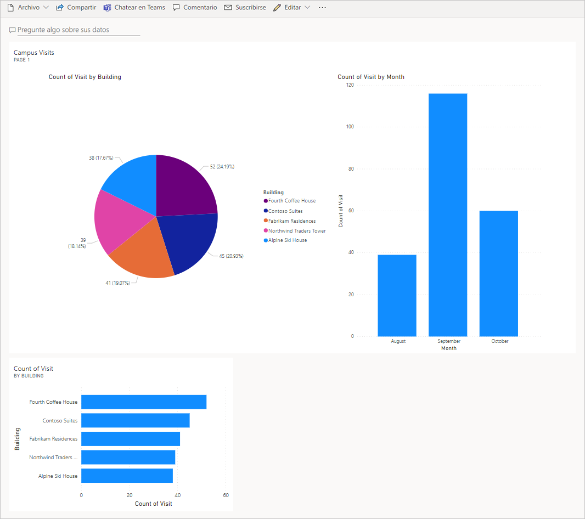

---
lab:
    title: 'Laboratorio 7: Cómo crear un tablero simple'
    module: 'Módulo 5: Comience con Power BI'
---

# Módulo 5: Comience con Power BI
## Laboratorio: Cómo crear un tablero simple

# Escenario

Bellows College es una institución educativa que tiene un campus con varios edificios. Los visitantes del campus están actualmente registrados en registros en papel. La información no se recaba de manera coherente y no hay forma de recopilar y analizar los datos sobre las visitas de todo el campus. 

La administración del campus querría modernizar el sistema de registro de visitantes de los edificios cuyo acceso esté controlado por el personal de seguridad y en los que los anfitriones deban anotar con antelación las visitas y dejar constancia de ellas.

A lo largo de este curso, creará aplicaciones e implementará la automatización para permitir que el personal de administración y seguridad de Bellows College administre y controle el acceso a los edificios en el campus. 

En este laboratorio, creará un panel de Power BI que visualice datos sobre las visitas al campus.

# Pasos de alto nivel del laboratorio

Seguiremos los pasos que se señalan a continuación para diseñar para crear el panel de información de Power BI:

-   Conectarse a Dataverse
-   Transformar los datos para incluir descripciones fáciles de usar para las filas relacionadas (búsquedas)
-   Crear y publicar un informe con varias visualizaciones de la información de las visitas al campus
-   Usar un lenguaje de consulta del usuario natural para crear visualizaciones adicionales
-   Crear una vista móvil del panel de información de Power BI


## Requisitos previos

* Haber finalizado el **Módulo 0, Laboratorio 0: Validación del entorno de laboratorio**
* Haber finalizado el **Módulo 2, Laboratorio 1: Introducción a Microsoft Dataverse**

## Cuestiones que conviene tener en cuenta antes de comenzar

-   ¿Quién es el público objetivo del informe?
-   ¿Cómo consumirá el informe el público? ¿Dispositivo típico? ¿Ubicación?
-   ¿Tiene suficientes datos para visualizar?
-   ¿Cuáles son las posibles características que puede usar para analizar datos sobre las visitas?

# Ejercicio 1: Crear informes de Power BI 

**Objetivo:** en este ejercicio creará un informe de Power BI basado en datos de la base de datos de Dataverse.

## Tarea 1: Instalar Power BI Desktop/Preparar el servicio Power BI

1. Siga las siguientes instrucciones para configurar Power BI: 

    - Si Power BI Desktop **ya** está instalado, pase a la [Tarea 2](#task-2-prepare-data)
    
    - Si no tiene Power BI Desktop instalado, complete el **Paso 2**
    
    - Si no tiene los permisos necesarios o tiene problemas con la ejecución de Power BI Desktop, continúe con el **Paso 4**

2. Visite [https://aka.ms/pbidesktopstore](https://aka.ms/pbidesktopstore) para descargar e instalar Power BI Desktop.

    > [IMPORTANTE]
    > Si tiene problemas para instalar Power BI Desktop con Microsoft Store, pruebe con el instalador independiente que se puede descargar desde [https://aka.ms/pbiSingleInstaller](https://aka.ms/pbiSingleInstaller).

3. Si instaló Power BI Desktop correctamente, ya puede pasar a la [Tarea 2](#task-2-prepare-data). De lo contrario, continúe con el siguiente paso.

    > Si no tiene los permisos necesarios para instalar aplicaciones de escritorio o tiene dificultades para ejecutar o configurar Power BI Desktop, complete los pasos de la siguiente tarea.

4. Descargue [visits.pbix](../../Allfiles/visits.pbix) y guárdelo en su equipo.

5. Vaya a [https://app.powerbi.com/](https://app.powerbi.com/) y haga clic en **Iniciar sesión**. 

6. Haga clic en **Mi área de trabajo**. 

7. Cuando aparezca la página **Obtener datos**, haga clic en **Omitir**. 

8. Expanda **+Nuevo** y seleccione **Cargar un archivo**.

    > [IMPORTANTE]
    > Si no ve **+Nuevo**, es posible que deba activar el nuevo aspecto de Power BI. Asegúrese de que **Nuevo aspecto** aparece como **Activado** en la parte superior de la pantalla.

9. Seleccione **Archivo local**.

10. Busque y seleccione el archivo **visits.pbix** que ha descargado anteriormente.

11. Una vez completada la carga de datos, seleccione el informe de **visitas** (observe que el Tipo se establece en **Informe**).

12. Haga clic en **Editar**. Si el elemento del menú **Editar** no es visible, haga clic en **...** y luego seleccione **Editar**.

13. Ya ha configurado el servicio Power BI para usarlo en sus laboratorios. Continúe con la [Tarea 3](#task-3-create-chart-and-time-visualizations), pero use el servicio Power BI en línea en [https://app.powerbi.com](https://app.powerbi.com) en lugar de Power BI Desktop durante el resto del laboratorio.

## Tarea 2: Preparar los datos

1.  Descubra la URL de su organización

    * En una pestaña nueva, vaya al Centro de administración de Power Platform en <https://admin.powerplatform.com>.
    
    * En la página de navegación izquierda, seleccione Entornos y, después, abra su entorno de práctica.
    
    * Haga clic con el botón derecho del ratón en la **URL de entorno** del panel **Detalles** y luego seleccione **Copiar dirección del vínculo**.
    
2. Abra Power BI Desktop e inicie sesión con las credenciales que le han dado si se le pide.

3. Seleccione **Obtener datos** y, después, elija **más...**.

4. Seleccione **Power Platform** a la izquierda, luego seleccione **Common Data Service (heredado)** y presione **Conectar**. Si se le pide, inicie sesión con las credenciales que le han proporcionado y haga clic en **Conectar**.

5. Pegue la URL del entorno que copió anteriormente en el campo **URL del servidor** y pulse **Aceptar**.

6. Expanda el nodo **Entidades**, seleccione las entidades **bc_Building** y **bc_Visit** y haga clic en **Cargar**.

7. Haga clic en el icono **Modelo** de la barra de herramientas vertical izquierda.

8. Arrastre la columna **bc_buildingid** desde la tabla **bc_Building** y suéltela en la columna **bc_building** de la tabla **bc_Visit**. Esto creará una relación entre las dos tablas que Power BI podrá usar para mostrar datos relacionados.

9. Seleccione el icono **Informe** en la barra de herramientas izquierda.

10. Expanda el nodo **bc_Visit** en el panel **Campos**.

11. Haga clic en **...** junto a **bc_Visit** y seleccione **Nueva columna**.

12. Complete la fórmula del siguiente modo:

    ```
    Column = RELATED(bc_Building[bc_name])
    ```

    y pulse ENTRAR. Esto agregará un nuevo campo con el nombre del edificio en los datos de las visitas.

13. Haga clic en **...** junto al campo **Columna** que acaba de crear y seleccione **Cambiar nombre**. Escriba **Edificio** como nombre del campo.

14. Haga clic en **...** al lado del campo **bc_visitid** y seleccione **Cambiar nombre**. Escriba **Visita** como nombre del campo.

15. Haga clic en **...** al lado del campo **bc_scheduledstart** y seleccione **Cambiar nombre**. Escriba **Inicio** como nombre del campo.

16. Para guardar el trabajo en curso, pulse **Archivo \| Guardar** y escriba el nombre de archivo que quiera.

## Tarea 3: Crear gráficos y visualizaciones de tiempo

1. Pulse el icono de gráfico circular del panel **Visualizaciones** para insertar un gráfico.

2. Arrastre el campo **Edificio** y colóquelo en el cuadro **Leyenda**.

3. Arrastre el campo **Visita** y colóquelo en el cuadro de destino **Valores**.

4. Para cambiar el tamaño del gráfico circular, utilice los controladores de las esquinas y todos los componentes del gráfico serán visibles.

5. Haga clic en el informe que está fuera del gráfico circular para anular la selección y seleccione el gráfico de columnas apiladas en el panel **Visualizaciones**. 

6. Arrastre el campo **Visita** y colóquelo en el cuadro de destino **Valores**.

7. Arrastre el campo **Comienzo** y colóquelo en el cuadro de destino **Eje**.

8. En el panel Visualizaciones, haga clic en **X** junto a **Día** y **Trimestre** para dejar solo los totales de **Año** y **Mes** en el eje.

9. Cambie el tamaño del gráfico como desee con los controladores de las esquinas.

10. Pruebe la interactividad del informe:

    * Seleccione varios sectores de edificios en el gráfico circular y observe los cambios en el informe de tiempos.
    
    * Haga clic en el gráfico de columnas. Pulse la flecha que indica hacia abajo para activar el modo **Explorar en profundidad** y luego pulse la columna para explorar en profundidad hasta el siguiente nivel (meses). Otra forma de hacer esto es hacer clic en **Datos/Explorar \| Expandir el siguiente nivel** en la barra de herramientas.
    
    * Agrupe y desagrupe datos para rastrear y seleccione varias barras en el gráfico de columnas de tiempo para observar los cambios en el informe circular.
    
11. Para guardar el trabajo en curso, pulse **Archivo \| Guardar**.

# Ejercicio 2: Crear un panel de control de Power BI

## Tarea 1: Publicar el informe de Power BI

1. Pulse el botón **Publicar** en la pestaña Inicio de la barra de herramientas.

2. Seleccione **Mi área de trabajo** como destino y luego pulse **Seleccionar**.

3. Espere hasta que se complete la publicación y haga clic en **Abrir\<nombre de su informe\>.pbix en Power BI**.

## Tarea 2: Crear un panel de control de Power BI

1. Debería tener abierto el informe de la tarea anterior.

2. Seleccione **Anclar a un panel** en el menú. Según el diseño, es posible que deba pulsar **...** para mostrar los elementos de menú adicionales.

3. Seleccione **Nuevo panel** en la confirmación de **Anclar al panel**.

4. Escriba **[Su apellido] Administración del campus** como un **Nombre de panel** y pulse **Anclar elemento activo**.

5. Seleccione **Mi área de trabajo** en la parte superior y después seleccione el panel **[Su apellido] Administración del campus**.

6. Pruebe la interactividad de los gráficos circulares y de barras que se muestran.

## Tarea 3: Agregar visualizaciones con lenguaje natural

1. En el panel de información **Administración del campus**, seleccione la barra **Preguntar algo sobre sus datos** en la parte superior.

2. Escriba **edificios por número de visitas** en el área de preguntas y respuestas. Se mostrará el gráfico de barras.

3. Seleccione **Anclar visualización**.

4. Seleccione **Panel existente**, seleccione su panel **[Su apellido] Administración del campus** y pulse **Anclar**.

5. Haga clic en **Salir de Preguntas y respuestas**.

Se debería mostrar el panel **[Su apellido] Administración del campus**. Es posible que deba desplazarse hacia abajo para ver el nuevo objeto visual Preguntas y respuestas. 

Su panel debería tener un aspecto similar al siguiente:



## Tarea 4: Crear una vista de teléfono móvil y compartir un informe con un código QR

1. En el panel, seleccione **Editar \| Vista móvil**.

2. Reorganice los iconos como desee.

3. Haga clic en **Vista de teléfono** en la parte superior derecha y cambie la Vista a **Vista web**.

4. Seleccione **Mi área de trabajo** en la parte superior y seleccione su **Informe**.

5. Seleccione **Editar** y luego **... \| Generar código QR**.

6. *Opcional:* si tiene un dispositivo móvil, escanee el código con una aplicación de escáner de QR, disponible en plataformas iOS y Android, o en la aplicación de la cámara, si su teléfono la admite. Inicie sesión en su cuenta si se le pide. Navegue y explore el informe en un dispositivo móvil.

# Retos

* Cree paneles e informes para incluir los planos del edificio y el campus
* Informe y analice patrones y tendencias de visitas
* Visualización sobrepasada
* Streaming de Power BI para un procesamiento casi en tiempo real en un campus grandes 
