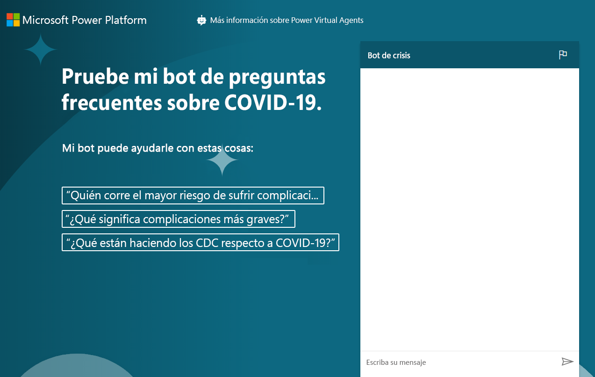

---
lab:
  title: 'Laboratorio 8: Cómo crear un bot de chat básico'
  module: 'Module 6: Intro to Power Virtual Agents'
ms.openlocfilehash: ed1611f4b1450093a6e95cbb9df7ad7fdc040e86
ms.sourcegitcommit: ef58c858463b890e923ef808b1d43405423943fd
ms.translationtype: HT
ms.contentlocale: es-ES
ms.lasthandoff: 01/27/2022
ms.locfileid: "137899050"
---
# <a name="module-6-intro-to-power-virtual-agents"></a>Módulo 6: Introducción a Power Virtual Agents
## <a name="lab-how-to-build-a-basic-chatbot"></a>Laboratorio: Cómo crear un bot de chat básico

# <a name="scenario"></a>Escenario

Bellows College es una institución educativa que tiene un campus con varios edificios. Actualmente se guarda un registro físico de las visitas al campus. La información no se recaba de manera uniforme y no hay forma de recopilar y analizar los datos sobre las visitas de todo el campus.

Como la mayoría de las organizaciones, Bellows College está respondiendo rápidamente a las preocupaciones por desinformación sobre la COVID-19, los procedimientos recomendados, los horarios, etc. En este laboratorio, creará un bot de chat de Power Virtual Agents que dirigirá a la página del Centro para el control de enfermedades con preguntas y respuestas sobre el estado actual de la pandemia. La universidad querrá esta configuración para que se pueda integrar en su portal web, así como para que esté disponible ad hoc a medida que los departamentos hagan su propia reapertura planificada.

## <a name="high-level-steps"></a>Pasos de alto nivel

Seguiremos el esquema a continuación para crear un agente virtual de Power Virtual Agents:

  - Suscríbase para obtener una prueba de Power Virtual Agents

  - Cree un bot usando las preguntas frecuentes

  - Probar el bot

  - Cambie el saludo predeterminado

  - Publicar el bot

  - **Desafío adicional:** Inserte el bot en su portal

## <a name="prerequisites"></a>Prerrequisitos

Se han identificado las siguientes condiciones como requisitos que debe implementar para completar el proyecto:

  - Finalización del **Módulo 0 Laboratorio 0: Validación del entorno de laboratorio**

  - Finalización del **Módulo 2 Laboratorio 1: Introducción a Microsoft Dataverse**

  - Solo para el ejercicio adicional: Finalización del **Módulo 6, Laboratorio 4: Introducción a los portales de Power Apps** 

## <a name="things-to-consider-before-you-begin"></a>Cuestiones que tener en cuenta antes de comenzar

Los bots pueden ser muy útiles en muchos escenarios diferentes. Según lo que sabe hasta ahora sobre Bellows College, considere en qué otro lugar de la organización podría ser útil usar un bot.

# <a name="exercise-1-sign-up-for-pva-and-create-a-new-bot"></a>Ejercicio \#1: Suscribirse en PVA y crear un nuevo bot

En este ejercicio, se suscribirá para obtener una prueba de Power Virtual Agents.

1.  Navegue a [Power Virtual Agents](https://powerva.microsoft.com/).

2.  Haga clic en **Iniciar prueba gratuita**.

3.  Conéctese, si es necesario.

4. Debería aparecer la ventana **Crear nuevo bot**.

5. Escriba **Bot de crisis** en **Nombre** y seleccione un idioma.

6. Seleccione su entorno de práctica para crear el bot y haga clic en **Crear**. Espere a que se cree el bot. Haga clic en **Explorar bot** si se le solicita.

7. Pruebe el bot. Escriba **Hola** en el cuadro de mensaje y haga clic en **Enviar**. El bot debería saludarle y decirle lo que puede hacer.

8. Cierre el **Chat**.

9. Seleccione **Temas**. El bot viene con algunos temas del usuario de muestra y algunos temas del sistema. El saludo predeterminado procede de los temas del sistema.

> En el próximo ejercicio, generará sus propios temas desde el sitio de P+F de los CDC. No salga de esta ventana del explorador.

# <a name="exercise-2-create-topics"></a>Ejercicio \#2: Crear temas

En este ejercicio, creará temas del sitio de P+F de los CDC.

1.  En una nueva pestaña, navegue hasta el sitio [P+F de los CDC](https://www.cdc.gov/coronavirus/2019-ncov/faq.html) y examine su contenido. Creará sus temas a partir de estas preguntas frecuentes.

2.  Copie la dirección URL.

3.  Vuelva a Power Virtual Agents y asegúrese de que **Temas** siga seleccionado.

4.  Seleccione la pestaña **Sugerencias** debajo de **Temas**.

5.  Haga clic en **Comenzar**.

6. Pegue la URL que copió en el cuadro de texto **Vínculo al contenido en línea** y haga clic en **Agregar**. Tenga en cuenta que si copió la dirección URL completa, https:// aparecerá dos veces. Asegúrese de que la dirección URL solo muestra el protocolo una vez.

7.  Haga clic en **Iniciar** y espere. Esta operación puede tardar unos minutos.

8.  Debería obtener algunas sugerencias de temas creados para usted. Haga clic para abrir uno de los temas sugeridos.

9. Debería ver la frase desencadenante y cuál será la respuesta del bot. **Haga clic en Agregar a temas.**
    
10. El tema sugerido debería agregarse a sus temas. Seleccione todos los temas sugeridos y haga clic en **Agregar a temas**. 

    > Puede seleccionar todos los temas usando el icono a la izquierda de la columna Nombre. Si recibe un mensaje de error, vuelva a intentarlo.

11. Una vez que se hayan agregado los temas sugeridos, seleccione la pestaña **Existente**. Debería ver los nuevos temas con su estado en Desactivado.

12. Use el botón de alternancia de la columna **Estado** si quiere que algunos temas estén en modo **Activado**. 

13. Anote la frase desencadenadora de uno de los temas que haya activado para poder probarlo más tarde.

> No salga de esta ventana del explorador.

# <a name="exercise-3-test-topics"></a>Ejercicio \#3: Probar temas

En esta tarea, probará los temas que ha agregado.

1.  Haga clic en **Probar el bot** en la parte inferior izquierda.

2.  Haga clic en **Restablecer**.

3.  Escriba la frase desencadenadora de la tarea anterior que anotó y haga clic en **Enviar**.

4.  El bot debería proporcionarle la información correcta y preguntarle si respondió a su pregunta. Haga clic en **Sí**.

5.  El bot debería pedirle una valoración de cómo lo hizo. Dele una valoración excelente.

6.  El bot debería preguntar si puede ayudarle con algo más. Haga clic en **No, gracias**.

7.  El bot debería concluir la sesión de chat.

8.  Escriba **hola** y haga clic en **Enviar**.

9.  El bot debería saludarle y decirle lo que puede hacer. El bot ahora puede ayudar a los usuarios con las preguntas más frecuentes sobre COVID-19, por lo que tendrá que cambiar el mensaje de saludo en la siguiente tarea. No salga de esta ventana del explorador.

# <a name="exercise-4-change-the-greeting"></a>Ejercicio \#4: Cambiar el saludo

En esta tarea, cambiará el saludo a uno específico para temas sobre la COVID-19.

1.  Asegúrese de tener seleccionado **Temas** y la pestaña **Existente**.

2.  Contraiga la sección **Temas de usuario**.

3.  Haga clic para abrir el tema **Saludo** de los temas del sistema. También puede usar el cuadro de búsqueda para **Buscar temas existentes**.

4.  El tema del saludo tiene 52 frases desencadenantes, haga clic en **Ir al lienzo de creación**.

5.  Vaya al primer mensaje y reemplácelo por `Hi, I’m a virtual agent. I can tell you about how COVID-19 spreads, how to protect yourself, preparing your home and family for COVID-19, symptoms, testing, and more.`.

6.  Haga clic en **Save**(Guardar).

7.  Haga clic en **Bot de prueba** si su bot no sigue abierto. Haga clic en **Restablecer** para restablecer el chat.

8.  Escriba hola y haga clic en **Enviar**.

9.  El bot debería responder ahora con el nuevo saludo.

# <a name="exercise-5-publish-the-bot"></a>Ejercicio \#5: Publicar el bot

En este ejercicio, publicará el bot.

1.  Seleccione **Publicar** en la barra de navegación izquierda.

2.  Haga clic en **Publicar**.

3.  Haga clic de nuevo en **Publicar** y espere a que se complete la publicación.

4.  Expanda **Administrar** en la barra de navegación izquierda y seleccione **Canales**.

5.  Obtendrá una lista de los canales disponibles en los que puede publicar su bot. Seleccione **Sitio web demo**.

6.  Cambie el mensaje de bienvenida a `Try my COVID-19 FAQ bot.`.

7.  Escriba lo siguiente en **Iniciadores de conversación**:
    ```
     “Who is at higher risk for serious illness from COVID-19”
     “What does more severe illness mean”
     “What is the CDC doing about COVID-19”
    ```
    
8.  Haga clic en **Save**(Guardar).

9.  Copie la **dirección URL**.

> Puede compartir la URL con sus compañeros y obtener sus comentarios. 

10.  Abra una nueva ventana o pestaña del explorador y navegue hasta la URL que copió. El sitio web demo debería ser como la imagen inferior.

11. Continúe y empiece a chatear con el bot.  
    
Cuando haya terminado, su bot publicado debería tener un aspecto similar a esto:



# <a name="challenges"></a>Desafíos 
* Inserte su bot de chat en el portal de visitantes de Bellows College (más información sobre cómo hacerlo en **Agregar un bot a Power Apps** [aquí](https://docs.microsoft.com/en-us/power-virtual-agents/publication-connect-bot-to-web-channels)).
